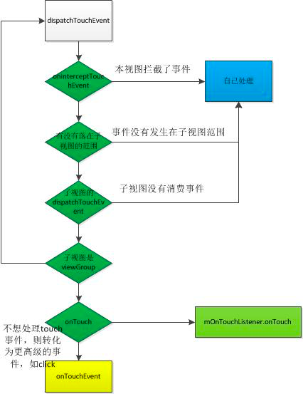

在Android中，事件主要包括点按、长按、拖拽、滑动等，点按又包括单击和双击，另外还包括单指操作和多指操作。  
InputEvent有两个直接子类： 
 
* KeyEvent（按键事件，按下，弹起、长按）
* MotionEvent（包括actionCode和一组值）  
例如，用于点击屏幕时，系统分发一个Touch event给相应的View
ActionCode——>ACTION_DOWN
一组值——>(X,Y)和点击的压力、尺寸、接触区域的方位

MotinEvent代表了动作事件，三个基本的Touch事件：按下（ACTION_DOWN）移动（ACTION_MOVE）抬起（ACTION_UP）
其他的事件如onClick、onLongClick、onScroll事件都是由一系列的Touch事件组成，比如onClick事件由ACTION_DOWN和ACTION_UP组成。
所有的UI控件（TextView、Button）都继承了View，所有的布局控件（RelativeLayout、LinearLayout）和容器控件如Listview都继承了VIewGroup

View.java

```
public boolean dispatchTouchEvent(MotionEvent event)  //事件分发，返回true，事件被消费
public boolean onTouchEvent(MotionEvent event)        //事件处理
```

ViewGroup.java

```
public boolean dispatchTouchEvent(MotionEvent event)     
public boolean onTouchEvent(MotionEvent event) 
public boolean onInterceptTouchEvent(MotionEvent event)      //事件拦截，只要在其表面就会调用，包括点击子View
```

所有的事件都是从开始经过传递到完成事件的消费，这些方法的返回值就决定了某一事件是否是继续往下传，还是被拦截了，或是被消费了。


Android中事件传递按照从上到下进行层级传递，事件处理从Activity开始到ViewGroup再到View  
当产生事件时，WindowManagerService会将消息派发到ViewRoot。  
这时会执行dispatchTouchEvent方法，dispatchTouchEvent在分发事件时，会调用onInterceptTouchEvent，如果该函数返回true，则事件不会被分发到子View。  
在给子View分发时，会调用frame.contains(scrolledXInt, scrolledYInt)判断事件发生的区域是否包含在子view的范围，则调用落在该范围的子view的dispatchTouchEvent方法，如果子view的dispatchTouchEvent方法返回true，则表明事件被该view消费，然后返回true。如果没有子view落在范围内，则调用super.dispatchTouchEvent进行处理（因为ViewGroup是View的子类，因此也就是交给ViewGroup进行相应）   
当传递给子view（比如button）进行处理时，调用dispatchTouchEvent，判断该控件有没有设置监听器、当前控件是否Enable、注册的mOnTouchListener.onTouch方法返回值，如果三个条件全部成立，返回true；否则回调onTouchEvent方法。

```
public boolean dispatchTouchEvent(MotionEvent event) {  //onTouch的优先级高于onTouchEvent
    if (mOnTouchListener != null && (mViewFlags & ENABLED_MASK) == ENABLED &&  
            mOnTouchListener.onTouch(this, event)) {  
        return true;  
    }  
    return onTouchEvent(event);  
}  
```

onClick方法在onTouchEvent方法中调用，在onTouchEvent中会根据事件的类型（按下（ACTION_DOWN）移动（ACTION_MOVE）抬起（ACTION_UP）取消（ACTION_CANCEL））,比如ACTION_DOWN然后ACTION_UP，会判定为一个click事件，然后调用preformClick处理。
执行顺序：

1. setOnTouchListener() 的onTouch 
2. onTouchEvent()
3. onClick()





