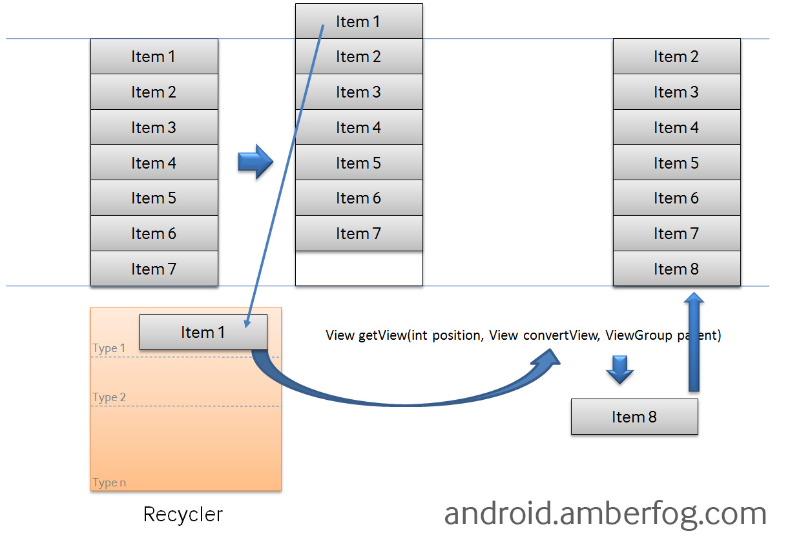

###加载数据的方法

1. CursorLoader


用于查询数据库，然后将结果以Cursor的形式返回，然后用SimpleCursorAdatpter将结果呈现在listView中。
ListActivity是默认仅仅包含ListView的Activity

示例：采用CursorLoader加载联系人信息（LoaderCallbacks接口，onLoaderFinished()）

~~~java
public class ListViewLoader extends ListActivity
        implements LoaderManager.LoaderCallbacks<Cursor> {
    // This is the Adapter being used to display the list's data
    SimpleCursorAdapter mAdapter;
    // These are the Contacts rows that we will retrieve
    static final String[] PROJECTION = new String[] {ContactsContract.Data._ID,
            ContactsContract.Data.DISPLAY_NAME};
    // This is the select criteria
    static final String SELECTION = "((" + 
            ContactsContract.Data.DISPLAY_NAME + " NOTNULL) AND (" +
            ContactsContract.Data.DISPLAY_NAME + " != '' ))";
    @Override
    protected void onCreate(Bundle savedInstanceState) {
        super.onCreate(savedInstanceState);
        // Create a progress bar to display while the list loads
        ProgressBar progressBar = new ProgressBar(this);
        progressBar.setLayoutParams(new LayoutParams(LayoutParams.WRAP_CONTENT,
                LayoutParams.WRAP_CONTENT, Gravity.CENTER));
        progressBar.setIndeterminate(true);
        getListView().setEmptyView(progressBar);
        // Must add the progress bar to the root of the layout
        ViewGroup root = (ViewGroup) findViewById(android.R.id.content);
        root.addView(progressBar);
        // For the cursor adapter, specify which columns go into which views
        String[] fromColumns = {ContactsContract.Data.DISPLAY_NAME};
        int[] toViews = {android.R.id.text1}; // The TextView in simple_list_item_1
        // Create an empty adapter we will use to display the loaded data.
        // We pass null for the cursor, then update it in onLoadFinished()
        mAdapter = new SimpleCursorAdapter(this, 
                android.R.layout.simple_list_item_1, null,
                fromColumns, toViews, 0);
        setListAdapter(mAdapter);
        // Prepare the loader.  Either re-connect with an existing one,
        // or start a new one.
        getLoaderManager().initLoader(0, null, this);
    }
    // Called when a new Loader needs to be created
    public Loader<Cursor> onCreateLoader(int id, Bundle args) {
        // Now create and return a CursorLoader that will take care of
        // creating a Cursor for the data being displayed.
        return new CursorLoader(this, ContactsContract.Data.CONTENT_URI,
                PROJECTION, SELECTION, null, null);
    }
    // Called when a previously created loader has finished loading
    public void onLoadFinished(Loader<Cursor> loader, Cursor data) {
        // Swap the new cursor in.  (The framework will take care of closing the
        // old cursor once we return.)
        mAdapter.swapCursor(data);
    }
    // Called when a previously created loader is reset, making the data unavailable
    public void onLoaderReset(Loader<Cursor> loader) {
        // This is called when the last Cursor provided to onLoadFinished()
        // above is about to be closed.  We need to make sure we are no
        // longer using it.
        mAdapter.swapCursor(null);
    }
    @Override 
    public void onListItemClick(ListView l, View v, int position, long id) {
        // Do something when a list item is clicked
    }
}
~~~

2. 从数组中加载数据（默认调用数组中对象的toString()方法）

```java
ListView listView = (ListView) findViewById(R.id.listview);
ArrayAdapter<String> adapter = new ArrayAdapter<String>(this,
        android.R.layout.simple_list_item_1, myStringArray);
listView.setAdapter(adapter);
```
###ListView的优化
优化ListView，使得ListView更加流畅的基本思路是：将繁重的处理任务移交到另外的线程，以便主线程集中精力绘制UI

1. 后台线程

```java
// Using an AsyncTask to load the slow images in a background thread
new AsyncTask<ViewHolder, Void, Bitmap>() {
    private ViewHolder v;
    @Override
    protected Bitmap doInBackground(ViewHolder... params) {
        v = params[0];
        return mFakeImageLoader.getImage();
    }
    @Override
    protected void onPostExecute(Bitmap result) {
        super.onPostExecute(result);
        if (v.position == position) {
            // If this item hasn't been recycled already, hide the
            // progress and set and show the image
            v.progress.setVisibility(View.GONE);
            v.icon.setVisibility(View.VISIBLE);
            v.icon.setImageBitmap(result);
        }
    }
}.execute(holder);
```

2. ViewHolder，省去频繁地从XML中解析和findviewById

```java
ViewHolder holder = new ViewHolder();
holder.icon = (ImageView) convertView.findViewById(R.id.listitem_image);
holder.text = (TextView) convertView.findViewById(R.id.listitem_text);
holder.timestamp = (TextView) convertView.findViewById(R.id.listitem_timestamp);
holder.progress = (ProgressBar) convertView.findViewById(R.id.progress_spinner);
convertView.setTag(holder);
static class ViewHolder {
  TextView text;
  TextView timestamp;
  ImageView icon;
  ProgressBar progress;
  int position;
}
Android BaseAdapter convertView重用视图
@Override
public View getView(int position，View convertView，ViewGroup parent)
{
     if(convertView!=null)
     {//如果没有回收view时，convertView为空
            ViewHolder viewholder=new ViewHolder();
            ......
     }else{//当滑动listview，导致某些Item跑出到屏幕外面，convertView不为空
             viewholder=(ViewHolder)convertView.getTag();
     }
}
```

有限屏幕显示大量的数据，出现视图更新的问题，重用View，提高程序的性能。  
为ListView设置视图时，经常使用BaseAdapter  
AdapterView（视图被Adapter决定）的子类：ExpandableListView, Gallery, GridView, ListView, Spinner, StackView    
需要覆盖四个方法 
 
* public int getCount() //绘制视图时调用，用于获取视图中item的总数
* public Object getItem(int position) //用于在点击事件中，获取当前点击item的数据（绘制视图时不会调用）
* public long getItemId(int position) //也是在点击事件中，获取当前item的ID
* public View getView(int position, View convertView, ViewGroup parent) //用于获取position处的视图,convertView!=null,表示回收的View

如果listView中有多种不同的视图形式，需要覆写
public int getItemViewType(int position)  //在position处是哪种类型的视图 [1,getViewTypeCount]
public int getViewTypeCount() //表示视图种类的个数（总共有多少种不同的视图）


RecyclerView代表的意义是，只负责Recycler View（回收与复用View）
可以通过LayoutManager，控制其显示的样式；通过ItemDecoration，控制Item之间的间隔；通过ItemAnimator，控制Item的增删动画；通过Adapter，控制显示的内容。


