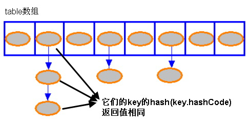

##HashMap插入逻辑

根据 Hash 算法来计算 key-value 的存储位置

```java
public V put(K key, V value) {
    if (key == null) {
        return putValueForNullKey(value);//value也可以为空，但是key为空的元素只能有一个
    }
    int hash = Collections.secondaryHash(key);//计算key的hash，Wang/Jenkins hash,雪崩性，可逆性
    HashMapEntry<K, V>[] tab = table;
    //计算元素保存的位置，index的范围 [0,tab.length-1],tab.length为2的n次方
    int index = hash & (tab.length - 1);
    for (HashMapEntry<K, V> e = tab[index]; e != null; e = e.next) {//hash值相同，key.equals不相等，Entry链
        if (e.hash == hash && key.equals(e.key)) {
            preModify(e);
            V oldValue = e.value;
            e.value = value;
            return oldValue;
        }
    }
    // No entry for (non-null) key is present; create one
    modCount++;
    if (size++ > threshold) {
        tab = doubleCapacity();//容量不够，加倍
        index = hash & (tab.length - 1);
    }
    addNewEntry(key, value, hash, index);//插入到Entry的头部，table[index]
    return null;
}
```

##Table数组结构



table的索引在逻辑上叫做“桶”(bucket)，它存储了链表的第一个元素。

* HashMap的实体结构，HashMapEntry结构

```java
static class HashMapEntry<K, V> implements Entry<K, V> {
        final K key;
        V value;
        final int hash;
        HashMapEntry<K, V> next;
}
```


* LinkedHashMap的实体，LinkedEntry结构，形成双向链表

```java
static class LinkedEntry<K, V> extends HashMapEntry<K, V> {
        LinkedEntry<K, V> nxt;
        LinkedEntry<K, V> prv;
}
```

必须为键覆盖hashCode()和equals()方法，因为在由键查找值的过程中，首先调用key.hashCode()，然后按照哈希值查找键，找到键后，调用key.equals()判断两个键是否相同。

Object默认使用对象的地址计算散列码

通过键对象生成一个数字，作为数组的下标，这个数字就是散列码。
