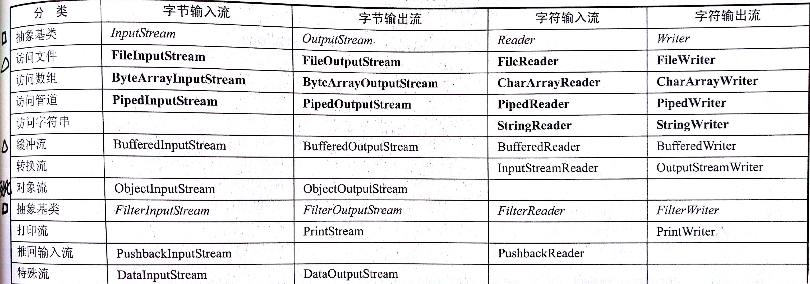
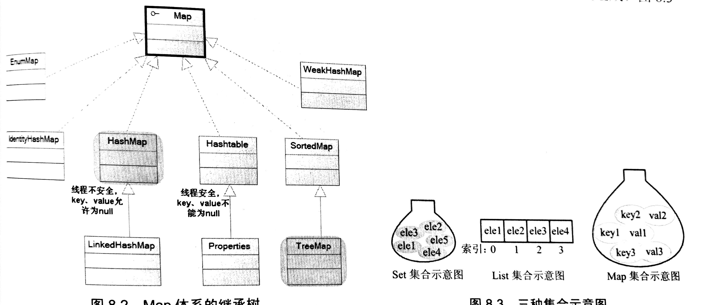

Java必须先编译生成与平台无关的字节码（*.class文件），字节码是JVM能够理解的代码（所有平台的JVM提供相同的编程接口），然后使用Java解释器来解释执行。
Oracle制定的Java虚拟机标准，指令集、寄存器、类文件格式、栈、垃圾回收堆、存储区
面向对象的三个基本特征：
1. 封装。将对象的实现细节隐藏，通过公用的方法来暴露该对象的功能。
2. 继承。实现代码复用，子类继承父类后，作为特殊的父类，获得父类的属性和方法。
3. 多态。子类对象可以直接赋值给父类变量，运行时依然保持子类的行为特征。这意味着同一类型的对象在执行同一个方法(可以在运行时把该变量绑定到不同的对象)时，可能表现出不同的行为特征。。


| 类内部       | 本包   | 子类   | 外部包  |
| --------- | ---- | ---- | ---- |
| public    | √    | √    | √    |
| protected | √    | √    | √    |
| default   | √    | √    | ×    |
| private   | √    | ×    | ×    |
default只能在本包中访问，protected相当于传递给子类的一种继承的东西。
Java的访问控制是停留在编译层的，也就是它不会在.class文件中留下任何的痕迹，只在编译的时候进行访问控制的检查。
this关键字两种使用场景
1. 构造器中，该构造器正在初始化的对象的引用
2. 方法中，调用该方法的引用

根据变量定义的位置不同，分为成员变量（类中定义）和局部变量（方法声明的形参、方法局部变量、代码块局部变量）

```java
class Person{
   public String name;
   public static int eyeNum;
}
```


局部变量必须显示初始化才能使用，保存在所在方法的栈内存中（基本类型保存数值，引用类型保存引用）
##多态

* 编译时类型（声明变量时的类型）
* 运行时类型（赋值给变量的对象类型）

private方法被自动认为是final方法，无法进行重写。
如果编译时类型和运行时类型不一致，就会出现多态;调用方法时，执行子类的方法。同一消息可以根据发送对象的不同而采用多种不同的行为方式。

```java
Class BaseClass{
  public void test(){
  }
}
public class SubClass extends BaseClass{
  public void test(){
     System.out.println("test");
  }
  BaseClass tmp=new SubClass();//由于test方法是动态绑定的，因此即使通过泛化的BaseClass引用来调用，也能产生正确的行为
  tmp.test();//打印出 “test”
}
```

多态：编译器一直不知道对象的类型，但是方法调用机制能找到正确的方法体，并加以调用。
多态是通过后期绑定（动态绑定或运行时绑定）实现的，核心思想是在对象中安置某种“类型信息”

##构造器
当进行继承时，已知基类的一切，并且可以访问基类中public或protected的成员。为了确保所要使用的成员都已经构建，在进入导出类构造器时，基类的构造器都已经调用（调用的顺序是从根开始，直到最底层的导出类）。然后按照声明顺序调用成员的初始化方法，最后调用导出类构造器的主体。

```java
public class Sandwich extends Bread {
    private Cheese c=new Cheese();
    public Sandwich(){
        print("Sandwich");
    }
    public static void main(String []args)
    {
        new Sandwich();
    }
}
```

输出是，Bread()        Cheese()           Sandwich()


* final类不可以有子类
* immutable类，实例化后，实例变量不可改变，Java提供的八个包装类和String类都是不可变类
  如，Double d=new Double(6.5);

##基本数据类型

|类型| 长度 | 对应的包装类型
|-----|-----|---------|
|byte  | （1字节）|Byte|
|int	|（4字节）|Integer|
|short |（2字节）|Short|
|long  |（8字节）|Long|
|boolean|（1字节）|Boolean|
|char|（2字节）|Character|
|float|（4字节）|Float|
|double|（8字节）|Double|


test()/main()为方法，CowLeg为Cow的非静态内部类，非静态内部类中保存了一个外部类对象的引用（CowLeg对象中保存了Cow对象的引用）

##Java系统相关类
System代表当前运行Java程序的平台，可以取得系统相关的属性，如环境变量、系统属性
JNI调用的步骤：
1、Java程序声明native方法，没有实现，编译生成class文件
2、javah编译class文件，生成.h文件
3、cpp文件实现native方法，需要.h文件和JDK自带的jni.h文件
4、编译cpp文件生成动态链接库
5、System或Runtime的LoadLibrary()方法加载动态链接库文件

Runtime类代表Java程序的运行时环境，每个Java程序都有一个对应的Runtime实例，可以获取JVM相关信息，如处理器数量、内存信息[总内存、可用内存]

String StingBuffer StringBuilder

* String，一旦创建，包含在这个对象中的字符串不可变
* StringBuffer，提供append()/insert()/reverse()/setCharAt()/setLength()等方法改变字符序列，可以调用toString()方法转换成String
* StringBuilder，线程不安全，效率高，char数组，初始数组长度为     INITIAL_CAPACITY=16

##IO
流是从起源到接收的有序数据
字节流以字节为单位处理（8位字节），InputStream和OutputStream作为基类
字符流以字符为单位处理（16位字符），Reader和writer作为基类



实现进程间通信，访问管道的流，PipeInputStream、PipeOutputStream、
缓冲流，增加缓冲功能，提高读写效率，但是必须通过flush()才能将缓冲区的内容写入实际的物理节点,内部采用BufferedInputStream byte[] buf, BufferedReader char[] buf
对象流用于实现对象的序列化
转换流，InputStreamReader字节输入转换为字符输入；OutputStreamWriter字节输出转换为字符输出

```java
InputStreamReader reader=new InputStreamReader（System.in）;//InputSteam转换为Reader对象
//BufferedReader一次读取一行文本，没有读到换行符，程序阻塞
BufferedReader br=new BufferedReader（reader）;
```

```java
RandomAccessFile，随机（任意）访问，可以只读取文件的部分内容，seek()方法
//读写文件
File file = new File("hello.txt");
FileInputStream in = new FileInputStream(file);  
OutputStream  outputStream = new FileOutputStream("file-new.xml");
byte[] buf = new byte[1024];  
int len = in.read(buf); 
while(len!=-1)
{
    outputStream.write(buf,0,buf.length);
    len=in.read(buf);
}
in.close();
outputStream.close();
```

##java7 NIO.2
Paths.get("g:","publish","codes")获取Path对象，将给定字符串连缀成路径，返回“g:\publish\codes”
Files完成文件的复制、读取文件、写入文件
Files.copy(Paths.get("FilesTest.java"),new FileOutStream("a.txt"));
List<String> lines=Files.readAllLines(Paths.get("FileTest.java"),Chartset.forname("gbk"));//一次性读取文件的所有行
List<String > poem
Files.write(Paths.get("poems.txt"),poem,Charset.forname("gbk"));//多行写入文件

文件遍历

```java
Files.walkFileTree(Paths.get("g:","publish","code","15") , new SimpleFileVisitor<Path>()
    @override
    public FileVisitResult visitFile(Path file，BasicFIleAttributes attrs)throw IOException
    {
        System.out.println("正在访问文件")；
    }
    @override
   public FileVisitorResult preVisitDiretory(Path dir,BaseFileAttributes attrs)throw IOException
   {
       System.out.println("将要访问子目录")；
   }
      @override
       postVisitDirectory(){
     }
)
```

##Java集合类
Arraylist，默认初始长度为10，重新分配并进行拷贝，新容量=（旧容量*3)/2+1
也可以使用ensureCapacity(int minCapacity),一次性增加容量，从而提高性能
Collection接口


Map接口（保存具有映射关系的数组）



* java.util.Collection [I]

 * java.util.List [I].(精确的控制每个元素插入的位置,用户能够使用索引（元素在List中的位置,数组下标）来访问List中的元素，这类似于Java的数组,允许有重复元素,ListIterator接口)
     * java.util.ArrayList [C]（默认长度为10，可变大小的数组，扩充1.5倍+1）

        * java.util.LinkedList [C].(提供额外的get，remove，insert方法操作首部或尾部，常用来实现堆栈（stack），队列（queue）或双向队列)
        * java.util.Vector [C]（Vector非常类似ArrayList，但是Vector是同步的，两个线程同时操作，ConcurrentModificationException异常）
     * java.util.Stack [C]（push、pop、peek栈顶的元素、empty、search元素的位置）

 * java.util.Set [I]（不能包含有重复元素的集合，实现一个有效的equals(Object)方法）
     * java.util.HashSet [C]
        * java.util.SortedSet [I]
     * java.util.TreeSet [C]
 * java.util.Map [I]
  * java.util.SortedMap [I]
     * java.util.TreeMap [C]
  * java.util.Hashtable [C]（hashCode、equals，如果两个key相同，则hashcode必须相同，同步的）
  * java.util.HashMap [C]（非同步的）
  * java.util.LinkedHashMap [C]
  * java.util.WeakHashMap [C]

HastSet和Hashmap，采用hash算法来决定集合中元素的存储位置，“负载极限”决定了hash表的最大填满程度，当达到负载极限时，hash表会成倍的增加容量。例如负载极限为0.75，表示当hash表的3/4填满时，hash表会扩容，0.75是内存空间和查询时间的折中。
HashTable把方法用synchronized关键字修饰，以实现线程安全，如

```java
public synchronized V put(K key, V value) {}；
//LinkedList实现栈 contains(Object)  get(location)
class StackL {  
  private LinkedList list = new LinkedList();  
  public void push(Object v) {  
    list.addFirst(v);  
  }  
  public Object top() {  
    return list.getFirst();  
  }  
  public Object pop() {  
    return list.removeFirst();  
  }  
}  
//实现队列
class Queue {  
  private LinkedList list = new LinkedList();  
  public void put(Object v) {  
    list.addFirst(v);  
  }  
  public Object get() {  
    return list.removeLast();  
  }  
  public boolean isEmpty() {  
    return list.isEmpty();  
  }  
} 
```

操作集合的工具类 Collections
排序操作

* reverse(List list)，反转元素的顺序
* shuffle(List list)，随机打乱顺序
* sort(List list)，升序排序，将List转化为 
* array（list.toArray()），用Arrays.sort()实现
* swap(List list,int i,int j)，交换元素
* rotate(List list, int distance)，后diatance个元素整体移到前面

查找、替换操作

* binarySearch(List list,Object key)，二分查找
* max()
* min()
* frequency(Collection collection, Object o)指定元素出现的次数

操作数组的工具类Arrays

* sort(int [] array)//float[] array、double[] array，采用的算法Dual-Pivot Quicksort，分成三份
* binarySearch(Object[] array，Object)

同步控制
List list=Collections.synchronizedList(new ArrayList())；//创建线程安全的集合对象
Collection
通常这些元素都服从某种规则

 　　1. List必须保持元素特定的顺序
 　　2. Set不能有重复元素
 　　3. Queue保持一个队列(先进先出)的顺序
      都支持Iterator

```java
Iterator it = collection.iterator(); // 获得一个迭代子 
while(it.hasNext()) { 
　　Object obj = it.next(); // 得到下一个元素 
} 
```

 Map
一组成对的"键值对"对象，就像一个小型数据库。我们可以通过"键"找到该键对应的"值“。

总结

* 如果涉及到堆栈，队列等操作，应该考虑用List，对于需要快速插入，删除元素，应该使用LinkedList，如果需要快速随机访问元素，应该使用ArrayList。
* 如果程序在单线程环境中，或者访问仅仅在一个线程中进行，考虑非同步的类，其效率较高，如果多个线程可能同时操作一个类，应该使用同步的类。
* 要特别注意对哈希表的操作，作为key的对象要正确复写equals和hashCode方法。
* 尽量返回接口而非实际的类型，如返回List而非ArrayList，这样如果以后需要将ArrayList换成LinkedList时，客户端代码不用改变。这就是针对抽象编程。

##泛型
在定义类、接口、方法时，使用类型形参，在声明变量、创建对象、调用方法时指定

```java
public class Apple<T>
{
    private T info;
    ...
}
public static void main(String[] args)
{
   Apple<String> a1=new Apple<>("苹果")；
   Apple<Double> a2=new Apple<>(5.67);
}
```

##进程和线程

* 进程：多个程序的指令被快速轮换执行，多进程并发执行，目前操作系统大多采用效率更高的抢占式多任务操作策略。创建进程时，操作系统分配独立的内存空间和相关的资源
* 线程：同一个进程同时并发处理多个任务，线程拥有自己的栈、程序计数器、局部变量，但不拥有系统资源
  Java创建线程的三种方法
  1、继承Thread类，重新run()方法，然后实例化，调用对象的start()方法启动线程

```java
package com.thread;  
  
public class FirstThreadTest extends Thread{  
    int i = 0;  
    //重写run方法，run方法的方法体就是线程执行体  
    public void run()  
    {  
        for(;i<100;i++){  
        System.out.println(getName()+"  "+i);  
          
        }  
    }  
    public static void main(String[] args)  
    {  
        for(int i = 0;i< 100;i++)  
        {  
            System.out.println(Thread.currentThread().getName()+"  : "+i);  
            if(i==20)  
            {  
                new FirstThreadTest().run();  
                new FirstThreadTest().run();  
            }  
        }  
    }  
  
}  
```

2、实现Runnable接口，重写接口的run()方法，该实例作为Thread的target创建Thread对象，调用对象的start()方法启动线程

```java
package com.thread;  
  
public class RunnableThreadTest implements Runnable  
{  
  
    private int i;  
    public void run()  
    {  
        for(i = 0;i <100;i++)  
        {  
            System.out.println(Thread.currentThread().getName()+" "+i);  
        }  
    }  
    public static void main(String[] args)  
    {  
        for(int i = 0;i < 100;i++)  
        {  
            System.out.println(Thread.currentThread().getName()+" "+i);  
            if(i==20)  
            {  
                RunnableThreadTest rtt = new RunnableThreadTest();  
                new Thread(rtt,"新线程1").start();  
                new Thread(rtt,"新线程2").start();  
            }  
        }  
  
    }  
  
}  
```

3、创建Callable接口的实现类，并实现call()方法（run方法的增强版，有返回值，声明返回异常），使用FutureTask类（Future接口代表call方法的返回值，可以用isDone方法查询任务是否完成，或者直接用get方法获取结果，FutureTask类实现了Future接口和Runnable接口）来包装Callable对象，FutureTask对象作为Thread对象的target

```java
public class CallableThreadTest implements Callable<Integer>  
{  
  
    public static void main(String[] args)  
    {  
        CallableThreadTest ctt = new CallableThreadTest();  
        FutureTask<Integer> ft = new FutureTask<>(ctt);  
        for(int i = 0;i < 100;i++)  
        {  
            System.out.println(Thread.currentThread().getName()+" 的循环变量i的值"+i);  
            if(i==20)  
            {  
                new Thread(ft,"有返回值的线程").start();  
            }  
        }  
        try  
        {  
            System.out.println("子线程的返回值："+ft.get());  
        } catch (InterruptedException e)  
        {  
            e.printStackTrace();  
        } catch (ExecutionException e)  
        {  
            e.printStackTrace();  
        }  
  
    }  
  
    @Override  
    public Integer call() throws Exception  
    {  
        int i = 0;  
        for(;i<100;i++)  
        {  
            System.out.println(Thread.currentThread().getName()+" "+i);  
        }  
        return i;  
    }  
  
}  
```

当使用new关键字创建了一个线程，和其他java对象一样，仅仅由java虚拟机为其分配内存，并初始化成员变量的值；当调用start()方法后，线程处于就绪，jvm为其创建方法调用栈和程序计算器，等待JVM线程调度器调度

* sleep()和wait()的区别

sleep方法属于Thread类，表示线程暂停执行一段时间，让出CPU（进入阻塞状态），但是不会释放锁，然后自动恢复
wait方法属于Object，用于多线程的协作，wait/notify机制（调用wait和nitify方法前，必须获得object的锁），调用wait方法时释放锁，进入到等待锁定池。当别的线程调用notify时，等待的线程被唤醒，锁由jvm分配。一般和synchronized搭配使用。wait/notify/notifyall三个方法必须由同步监视器对象调用，在synchronized修饰的方法中，由于默认实例this就是监视器实例，所以在方法中可以直接调用。notifyAll会唤醒所有等待的线程，但是哪个线程获得锁，依赖于操作系统调度。而notify只会唤醒一个，因此如果不能保证notify唤醒的是恰当的任务（例如唤醒的任务可能还在等待其他条件，并不能执行，会引发死锁），则应该使用notifyAll
yield方法，暂停线程，无法指定时间，系统线程调度器重新调度，可能会马上再次执行。(它是对线程调度器的一种建议，“我已经执行完成生命周期中最重要的一部分，此刻可以切换给其他任务执行”)
Thread 优先级常量MAX_PRIORITY   10                      MIN_PRIORITY  1                        NORM_PRIORITY     5

```java
public class Test {
//线程1虽然先启动，但是只有等到线程2结束后才能开始执行
    public static Object object = new Object();
    public static void main(String[] args) {
        Thread1 thread1 = new Thread1();
        Thread2 thread2 = new Thread2();
         
        thread1.start();
        thread2.start();
    }
     
    static class Thread1 extends Thread{
        @Override
        public void run() {
            synchronized (object) {
                    object.wait();
                System.out.println("线程"+Thread.currentThread().getName()+"获取到了锁");
            }
        }
    }
     
    static class Thread2 extends Thread{
        @Override
        public void run() {
            synchronized (object) {
                object.notify();
                System.out.println("线程"+Thread.currentThread().getName()+"调用了object.notify()");
            }
            System.out.println("线程"+Thread.currentThread().getName()+"释放了锁");
        }
    }
}
```

Executor对象会管理Thread对象，执行相应的任务。
FixedThreadPool，会一次性预先执行代价高昂的线程创建，即一次性创建固定数量的线程，用于执行任务（Runnable）
CacheThreadPool，会创建与所需数量相同的线程，当有旧线程回收时，停止创建新线程。
SingleThreadPool，线程数量为1 的FixedThreadPool

```java
ExecutorService executorService= Executors.newCachedThreadPool();
for(int i=0;i<5;i++)
    executorService.submit(new Task());
executorService.shutdown();//调用shutdown可以防止新任务提交到这个Executor
```

ThreadLocal，解决多线程并发的变量访问，为每个使用该变量的线程提供独立的变量副本，每个线程可以独立改变自己的副本，而不会影响其他线程的副本。
根除对变量的共享，从而防止任务在共享资源上产生冲突。
实现方法，ThreadLocal类中有一个Map，键为线程对象，值为对应线程的变量副本。

```java
public class TreadLocalTest {
    static ThreadLocal<HashMap> map0 = new ThreadLocal<HashMap>(){ 
        @Override 
        protected HashMap initialValue() { //初始化方法
            System.out.println(Thread.currentThread().getName()+"initialValue"); 
            return new HashMap(); 
        } 
    }; 
    public static class T1 implements Runnable{ 
        int id; 
        public T1(int id0){ 
            id = id0; 
        } 
        public void run() { 
            System.out.println(Thread.currentThread().getName()+":start"); 
            HashMap map = map0.get(); //获取ThreadLocal的对象
            for(int i=0;i<10;i++){ 
                map.put(i, i+id*100); 
                try{ 
                    Thread.sleep(100); 
                }catch(Exception ex){ 
                } 
            } 
            System.out.println(Thread.currentThread().getName()+':'+map); 
        } 
    } 
```

* 控制线程

join线程，原理是wait，当调用jt.join时，获取线程对象jt的锁，然后调用wait，线程执行结束后唤醒主线程
join方法通常用于将大问题划分为多个小问题，每个小问题分配一个线程，当小问题处理完毕时，主线程做进一步的操作

```java
JoinThread jt=new JoinThread(“被Join的线程”);
jt.start();
jt.join();//本线程必须等到jt执行完毕，才能执行
```

* 后台线程
  所有的前台线程都死亡，后台线程自动死亡。JVM的垃圾回收线程就是典型的后台线程

```java
DaemonThread t=new DaemonThread();
t.setDaemon(true);//设置为后台线程
t.start();
```

前台线程创建的子线程默认是前台线程，后台线程创建的子线程默认是后台线程。
线程的同步
1、同步代码快
synchronized(obj)
{
}
obj通常采用共享资源充当同步监视器
2、同步方法，用synchronized关键字修饰的方法，同步监视器是调用该方法的对象
3、同步锁（lock），ReentranLock、ReadWriteLock

线程互斥访问（协调）——序列化访问共享资源，每个访问临界共享资源的方法都必须同步

1. 使用synchronized关键字
   对于某个特定的对象，其所有synchronized方法共享同一个锁。
   synchronized关键字在编译后会形成monitorenter、monitorexit指令，这两个指令需要一个引用指定锁定和解锁的对象。如果明确指定。。。。，如果synchronized修饰实例方法或者类方法，则对应的对象实例或者Class对象作为锁对象。Java线程映射到系统线程，所以阻塞、唤醒线程需要陷入核心态，所以比较重量级。

```java
public class Account
{
     public synchronized void draw (double drawAmount)
     {//取钱操作
           if(!flag){//没钱
                wait();
           }
          else
           {
                 balance-=drawAmount;
                 flag=false;
                notifyAll();
            }
     }
     public synchronized void deposit(double drawAmount)
     {//存钱
             if(flag){//有钱没取
                 wait();
             }
            else{
            balance+=drawAmount;
            flag=true;
            notifyAll();
         }
  }
}
```

2. 使用Lock
   显示的Lock具有细粒度的控制，例如可以在2s后（获取锁失败），然后开始干别的事情。而synchronized会在失败抛出异常。

```java
private ReentrantLock lock=new ReentrantLock();
boolean captured=lock.tryLock(2, TimeUnit.SECONDS);
```

遍历链表的节点传递加锁（释放当前节点的锁之前，捕获下一个节点的锁）
当使用Lock时，不存在同步监视器，因此无法调用wait/notify方法，Java提供了Condition类来保持协调。可以通过Condition，选择性地唤醒某类线程。

```java
class BoundedBuffer {//缓存区（多个写线程，多个读线程，如果不使用Condition，则无法确定唤醒写线程还是读线程）例如上例中notifyAll方法可能会唤醒所有线程。
   final Lock lock = new ReentrantLock();
   final Condition notFull  = lock.newCondition(); 
   final Condition notEmpty = lock.newCondition(); 
   final Object[] items = new Object[100];
   int putptr, takeptr, count;
   public void put(Object x) throws InterruptedException {
     lock.lock();
     try {
       while (count == items.length)//while循环是为了预防其他的写线程突然向缓存区写入，而导致缓存区满
         notFull.await();//缓存区满，阻塞写线程
       items[putptr] = x;
       if (++putptr == items.length) putptr = 0;
       ++count;
       notEmpty.signal();//写入后，通知读线程
     } finally {
       lock.unlock();
     }
   }
   public Object take() throws InterruptedException {
     lock.lock();
     try {
       while (count == 0)
         notEmpty.await();//缓存区空，阻塞读线程
       Object x = items[takeptr];
       if (++takeptr == items.length) takeptr = 0;
       --count;
       notFull.signal();
       return x;
     } finally {
       lock.unlock();
     }
   }
 }
```

阻塞队列（BlockingQueue）是Queue的子接口
生产者线程试图向BlockingQueue加入元素，如果队列已满，则线程阻塞；
消费者线程试图从BlockingQueue取出元素，如果队列已空，则线程阻塞。
包含五个实现类，

1. ArrayBlockingQueue
   一个由数组支持的有界阻塞队列，其构造函数必须带一个int参数来指明其大小.其所含的对象是以FIFO(先入先出)顺序
2. LinkedBlockingQueue
   规定其大小（可选）
3. PriortyBlockingQueue
   依据对象的自然排序顺序或者是构造函数的Comparator决定的顺序。
4. SynchronousQueue
   操作必须是放和取交替完成的

```java
class Producer extends Thread
{
    public void run(){
        for(int i=0;i<100;i++)
        {
            bq.put(i);//队列满时，阻塞
        }
    }
}
class Consumer extends Thread
{
    public void run(){
        bq.take();//队列空时，阻塞
    }
}
public class BlockingQueueTest
{
    public static void main(String args[]){
        BlockingQueue<Integer> bq=new ArrayBlockingQueue<Integer>(1);//面向抽象编程，BlockingQueue而不用ArrayBlockingQueue
        new Producer(bq).start();
        new Producer(bq).start();
        new Consumer(bq).start();
    }
}
```

实例——生产者消费者

```java
//采用wai/notify机制实现
public class Test {
    private int queueSize = 10;
    private PriorityQueue<Integer> queue = new PriorityQueue<Integer>(queueSize);
      
    public static void main(String[] args)  {
        Test test = new Test();
        Producer producer = test.new Producer();
        Consumer consumer = test.new Consumer();
          
        producer.start();
        consumer.start();
    }
      
    class Consumer extends Thread{
          
        @Override
        public void run() {
            consume();
        }
          
        private void consume() {
            while(true){
                synchronized (queue) {
                    while(queue.size() == 0){
                        try {
                            System.out.println("队列空，等待数据");
                            queue.wait();
                        } catch (InterruptedException e) {
                            e.printStackTrace();
                            queue.notify();
                        }
                    }
                    queue.poll();          //每次移走队首元素
                    queue.notify();
                    System.out.println("从队列取走一个元素，队列剩余"+queue.size()+"个元素");
                }
            }
        }
    }
      
    class Producer extends Thread{
          
        @Override
        public void run() {
            produce();
        }
          
        private void produce() {
            while(true){
                synchronized (queue) {
                    while(queue.size() == queueSize){
                        try {
                            System.out.println("队列满，等待有空余空间");
                            queue.wait();
                        } catch (InterruptedException e) {
                            e.printStackTrace();
                            queue.notify();
                        }
                    }
                    queue.offer(1);        //每次插入一个元素
                    queue.notify();
                    System.out.println("向队列取中插入一个元素，队列剩余空间："+(queueSize-queue.size()));
                }
            }
        }
    }
}
```

```java
//采用Condition实现
public class Test {
    private int queueSize = 10;
    private PriorityQueue<Integer> queue = new PriorityQueue<Integer>(queueSize);
    private Lock lock = new ReentrantLock();
    private Condition notFull = lock.newCondition();
    private Condition notEmpty = lock.newCondition();
     
    public static void main(String[] args)  {
        Test test = new Test();
        Producer producer = test.new Producer();
        Consumer consumer = test.new Consumer();
          
        producer.start();
        consumer.start();
    }
      
    class Consumer extends Thread{
          
        @Override
        public void run() {
            consume();
        }
          
        private void consume() {
            while(true){
                lock.lock();
                try {
                    while(queue.size() == 0){
                        try {
                            System.out.println("队列空，等待数据");
                            notEmpty.await();
                        } catch (InterruptedException e) {
                            e.printStackTrace();
                        }
                    }
                    queue.poll();                //每次移走队首元素
                    notFull.signal();
                    System.out.println("从队列取走一个元素，队列剩余"+queue.size()+"个元素");
                } finally{
                    lock.unlock();
                }
            }
        }
    }
      
    class Producer extends Thread{
          
        @Override
        public void run() {
            produce();
        }
          
        private void produce() {
            while(true){
                lock.lock();
                try {
                    while(queue.size() == queueSize){
                        try {
                            System.out.println("队列满，等待有空余空间");
                            notFull.await();
                        } catch (InterruptedException e) {
                            e.printStackTrace();
                        }
                    }
                    queue.offer(1);        //每次插入一个元素
                    notEmpty.signal();
                    System.out.println("向队列取中插入一个元素，队列剩余空间："+(queueSize-queue.size()));
                } finally{
                    lock.unlock();
                }
            }
        }
    }
}
```

*5. DelayQueue的使用场景，用于放置实现了Delayed接口的对象，其中的对象只能在其到期时才能从队列中取走。实现getDelay()方法，用于取DelayQueue里面的元素时判断是否到了延时时间，否则不予获取。  compareTo()方法用于进行队列内部的排序
a) 关闭空闲连接。服务器中，有很多客户端的连接，空闲一段时间之后需要关闭之。
b) 缓存。缓存中的对象，超过了空闲时间，需要从缓存中移出。
c) 任务超时处理。在网络协议滑动窗口请求应答式交互时，处理超时未响应的请求。
使用案例：缓存过期后清理；淘宝下单30分钟为付款取消订单（服务器守护线程从队列中获取，如果获取到超时订单则执行取消操作）

```java
public class Cache<K, V> {
    private ConcurrentMap<K, V> cacheObjMap = new ConcurrentHashMap<K, V>();
    private DelayQueue<DelayItem<Pair<K, V>>> q = new DelayQueue<DelayItem<Pair<K, V>>>();//保存添加的缓存及过期时间
    private Thread daemonThread;
    private void daemonCheck() {
        while (true) {//检查是否过期并清理
            try {
                DelayItem<Pair<K, V>> delayItem = q.take();
                if (delayItem != null) {
                    // 超时对象处理
                    Pair<K, V> pair = delayItem.getItem();
                    cacheObjMap.remove(pair.first, pair.second); // compare and remove
                }
            } catch (InterruptedException e) {
                break;
            }
        }
    }
}
```

ScheduledExecutorService
//周期性地执行
ScheduledExecutorService.scheduleAtFixedRate(new Runnable() )
//在给定delay后执行
ScheduledExecutorService.scheduleWithFixedDelay(new Runnable() )

java SE5中的新构件
如果是一个线程等待多个线程，则就可以使用CountDownLatch和CyclicBarrier来实现比较好的控制。
CountDownLatch
一个线程等待其他线程达到某个目标后，才进行自己的下一步工作，而其他线程在达到自己目标后可以继续其他任务。
经典用法是建一个任务分解为n个互相独立的可解决的任务，并创建值为n的CountDownLatch，每个任务完成时，都会在这个锁存器上调用countDown()。等待该任务执行完成，可以在这个锁存器上调用await，直到锁存器计数结束。
使用案例：百米赛跑：8名运动员同时起跑，由于速度的快慢，肯定有会出现先到终点和晚到终点的情况，而终点有个统计成绩的仪器，当所有选手到达终点时，它会统计所有人的成绩并进行排序，然后把结果发送到汇报成绩的系统。

```java
public class CountDownLatchDemo {
    static final int SIZE=100;
    public static void main(String []args)
    {
        ExecutorService executorService= Executors.newCachedThreadPool();
        CountDownLatch latch=new CountDownLatch(SIZE);
        for(int i=0;i<10;i++)////RandomTask全部执行完，才能开始执行
            executorService.execute(new WaitTask(latch));
        for(int i=0;i<SIZE;i++)
            executorService.execute(new RandomTask(latch));
        executorService.shutdown();
    }
    class WaitTask implements Runnable{
        private final CountDownLatch latch;
        WaitTask(CountDownLatch latch){
            this.latch=latch;
        }
        @Override
        public void run() {
            try{
                doWork();
                latch.countDown();
            }catch (InterruptedException ex){
                
            }
        }
    }
    class RandomTask implements Runnable{
        private final CountDownLatch latch;
        RandomTask(CountDownLatch latch){
            this.latch=latch;
        }
        @Override
        public void run() {
            try{
                latch.await();
            }catch (InterruptedException ex){
                
            }
        }
    }
}
```

CyclicBarrier
用于线程之间的互相等待，当几个线程都达到某种状态时，它们才能执行下一步动作    CyclicBarrier(int parties, Runnable barrierAction)其中Runnable代表栅栏动作，表示几个线程都达到某种状态时要自动执行的动作。
CountDownLatch在减到0时，通知await的任务；而CyclicBarrier可以多次重用
使用案例：有四个游戏玩家玩游戏，游戏有三个关卡，每个关卡必须要所有玩家都到达后才能允许通关。

```java
public class Player implements Runnable{
    private CyclicBarrier cyclicBarrier;
    private int id;
    public Player(int id, CyclicBarrier cyclicBarrier) {
        this.cyclicBarrier = cyclicBarrier;
        this.id = id;
    }
    @Override
    public void run() {
        try {
            System.out.println("玩家" + id + "正在玩第一关...");
            cyclicBarrier.await();
            System.out.println("玩家" + id + "进入第二关...");
        } catch (InterruptedException e) {
            e.printStackTrace();
        } catch (BrokenBarrierException e) {
            e.printStackTrace();
        }
    }
    public static void main(String[] args) {
        CyclicBarrier cyclicBarrier = new CyclicBarrier(4, new Runnable() {
            @Override
            public void run() {
                System.out.println("所有玩家进入第二关！");
            }
        });
        for (int i = 0; i < 4; i++) {
            new Thread(new Player(i, cyclicBarrier)).start();
        }
    }
}
```

线程间通信
共享内存，读写内存中的公共状态
消息传递，发送消息
线程池，【线程数少于corePoolSize，创建新线程处理请求，即使有空闲线程；大于corePoolSize，小于maxmumPoolSize，仅当任务队列满时，创建新线程。

```java
public class ThreadPoolTest {
    
    public static void main(String args[])
    {
        ExecutorService pool = Executors.newFixedThreadPool(6);//1、创建Executor对象代表一个线程池
        Runnable target = ()->{//2、创建Runnable实现类实例，线程任务
            for (int i=0;i<100;i++)
            {
                System.out.println(Thread.currentThread().getName()+ " i的值"+i);
            }
        };
        pool.submit(target);//3、submit提交任务到线程池
        pool.submit(target);
        pool.shutdown();//4、关闭线程池
    }
}
```

ForkJoinPool
任务拆分成小任务，多个小任务并发执行，然后组合结果，从而求解大任务。。


ForkJoinTask表示一个可以并行执行的任务，两个抽象子类：RecursiveAction（有返回值）、RecursiveTask（没有返回值）

```java
class CalTask extends RecursiveTask<Integer>
{
    private static final int THRESHLD=20;
    private int arr[];
    private int start;
    private int end;
    @Override
    protected Integer compute() {
        int sum=0;
        if(end-start<THRESHLD)
        {
            for (int i=start;i<end;i++)
            {
                sum+=arr[i];
            }
            return sum;
        }
        else
        {
            int middle=(start+end)/2;
            CalTask left=new CalTask(arr,start,middle);
            CalTask right=new CalTask(arr,middle,end);
            left.fork();//并行执行两个小任务
            right.fork();
            return left.join()+right.join();
        }
    }
}
public class Sum
{
    public static void main(String []args)
    {
        int[] arr=new int[100];
        ForkJoinPool pool=ForkJoinPool.commomPool();//创建ForkJoinPool，并提交任务
        Future<Integer> furute=pool.submit(new CalTask(arr,0,arr.length));
        pool.shutdown();
    }
}
```

##包装线程不安全的集合
synchronizedCollection、synchronizedList、synchronizedSet、synchronizedMap、synchronizedSortedMap、synchronizedSortedSet

```java
HashMap m=Collections.synchronizedMap(new hashMap());
@Override 
public void add(int location, E object) {//实现原理是将Add方法放在synchronized块中
            synchronized (mutex) {
                list.add(location, object);
            }
        }
```

线程的停止
AsyncTask能够通过cancle(true)停止，调用这个方法后会回调onCancled(Object)方法，而不会调onPostExcute(Object)
Thread的停止
不要使用Thread的stop方法停止线程，因为可能会引发死锁，应该采用修改某些变量来指示其目标线程将停止运行的方式，为了确保停止请求及时传递，变量用volatile的。

```java
private volatile Thread blinker;
    public void stop() {
        blinker = null;
    }
    public void run() {
        Thread thisThread = Thread.currentThread();
        while (blinker == thisThread) {//变量置Null，表示停止执行线程
            try {
                thisThread.sleep(interval);
            } catch (InterruptedException e){
            }
            repaint();
        }
    }
停止等待线程（例如socket、输入）
public void stop() {
        waiter = null;
        moribund.interrupt();//调用interrupt方法终止等待
}
```

如果线程不响应interrupt，则应该结合应用的情况采取措施，比如线程等待Socket，则可以关闭Socket，促使线程返回。
Thread的暂停和恢复,与停止类似，采用信号量，结合wait/nitify机制实现。

```java
public class ThreadManager implements Runnable{
    //用volatile保证变量同步
     private volatile boolean threadSuspended;
     @Override
     public void run() {
         Thread thisThread=Thread.currentThread();
         while(myThread==thisThread){
             try{
                 Thread.sleep(interval);
                  System.out.println(myThread.getName()+" is running.");
                 //先if一下，避免每次都进入同步块带来的开销
                 if(threadSuspended&&myThread==thisThread){
                     synchronized(this){
                         while(threadSuspended&&myThread==thisThread){
                              wait();
                          }
                      }
                  }
              }catch(InterruptedException e){
             }
         }
      public synchronized void stop(){
         if(myThread==null){
              return;
          }
          Thread moribund=myThread;
          myThread=null;
          moribund.interrupt();
      }
      public synchronized void suspend(){
          threadSuspended=!threadSuspended;
          if(!threadSuspended){
              notify();
          }
      }
}
```

网络编程
多线程下载文件
首先，请求文件总大小，然后创建一个RandomAccessFile，并设置大小，最后平均分配到每个下载线程

```java
public class DownUtil
{
    private int threadNum;
    private String targetFile;
    private  String path;
    private DownThread threads;
    public void download() throws Exception
    {
        URL url=new URL(path);
        HttpURLConnection httpURLConnection=(HttpURLConnection)url.openConnection();
        httpURLConnection.setConnectTimeout(5*1000);
        httpURLConnection.setRequestMethod("GET");
        httpURLConnection.setRequestProperty(
                "Accept",
                "image/gif,image/jpeg,image"
        );
        httpURLConnection.setRequestProperty("Accept-Language","zh-CN");
        httpURLConnection.setRequestProperty("Chartset","UTF-8");
        int filesize =httpURLConnection.getContentLength();//获取文件大小
        int currentPartSize=filesize/threadNum+1;
        httpURLConnection.disconnect();
        RandomAccessFile file=new RandomAccessFile(targetFile,"rw");
        file.setLength(filesize);//设置本地文件大小
        file.close();
        for(int i=0;i<threadNum;i++)
        {//计算每个线程的下载开始位置
            int startPos=i*currentPartSize;
            RandomAccessFile currentPart=new RandomAccessFile(targetFile,"rw");
            currentPart.seek(startPos);
            threads[i]=new DownThread(startPos,currentPartSize,currentPart);
            threads[i].start();
        }
    }
    public class DownThread extends Thread{
        private int startPos;
        private int currentPartSize;//线程负责下载大小
        private RandomAccessFile currentPart;
        public DownThread(int startPos,int currentPartSize,RandomAccessFile currentPart)
        {
            this.startPos=startPos;
            this.currentPartSize=currentPartSize;
            this.currentPart=currentPart;
        }
        public void run(){
            URL url=new URL(path);
            HttpURLConnection httpURLConnection=(HttpURLConnection)url.openConnection();
            httpURLConnection.setConnectTimeout(5*1000);
            httpURLConnection.setRequestMethod("GET");
            httpURLConnection.setRequestProperty(
                    "Accept",
                    "image/gif,image/jpeg"
            );
            httpURLConnection.setRequestProperty("Accept-Language","zh-CN");
            httpURLConnection.setRequestProperty("Chartset","UTF-8");
            InputStream inStream=httpURLConnection.getInputStream();
            inStream.skip(this.startPos);
            byte [] buffer=new byte[1024];
            int hasRead=0;
            while(length<currentPartSize&& (hasRead=inStream.read(buffer))!=-1)
            {
                currentPart.write(buffer,0,hasRead);
                length+=hasRead;
                
            }
            currentPart.close();
            inStream.close();
        }
    }
}
```

另一种方式断点续传

```java
httpConnection.setRequestProperty("RANGE",sProperty); //使用Http头的Range，进行断点续传
InputStream input = httpConnection.getInputStream(); 
byte[] b = new byte[1024]; 
 int nRead; 
 while((nRead=input.read(b,0,1024)) > 0 && nStartPos < nEndPos && !bStop) 
 { 
     nStartPos += fileAccessI.write(b,0,nRead); 
 } 
```

Http协议，URLConnection代表应用程序与URL之间的通信连接，HttpURLConnection代表Http连接
tcp协议，通信两端形成网络虚拟链路，服务器端ServerSocket，客户端Socket
UDP协议，没有虚拟链路，DatagramPacket代表发送或接收的数据报，DatagramSocket代表通信端（不必先建立连接，不管对方状态）

实现局域网聊天工具
功能点：
1、显示在线好友信息 
2、向在线好友发送广播 
3、和指定好友私聊
实现思路：
每个用户启动两个Socket，一个MulticastSocket，继承自DatagramSocket【周期性的发送在线信息、广播】，一个DatagramSocket【私聊信息】
启动两个读取数据线程
线程1，不断地从DatagramSocket读取数据

```java
 class ReadSingle extends Thread
    {
        // 定义接收网络数据的字节数组
        byte[] singleBuff = new byte[DATA_LEN];
        private DatagramPacket singlePacket =
                new DatagramPacket(singleBuff , singleBuff.length);
        public void run()
        {
            while (true)
            {
                    // 读取Socket中的数据。
                    singleSocket.receive(singlePacket);
                    // 处理读到的信息
                    lanTalk.processMsg(singlePacket , true);
             }
         }
}
```

线程2，持续读取MulticastSocket

```java
 class ReadBroad extends Thread
    {
         MulticastSocket socket = new MulticastSocket(BROADCAST_PORT);
        broadcastAddress = InetAddress.getByName(BROADCAST_IP);
        // 将该socket加入指定的多点广播地址
        socket.joinGroup(broadcastAddress);
        // 设置本MulticastSocket发送的数据报被回送到自身
        socket.setLoopbackMode(false);
        public void run()
        {
            while (true)
            {
                    // 读取Socket中的数据。
                    socket.receive(inPacket);
                    // 打印输出从socket中读取的内容
                    String msg = new String(inBuff , 0
                            , inPacket.getLength() , CHARSET);
                    // 读到的内容是在线信息
                    if (msg.startsWith(YeekuProtocol.PRESENCE)
                            && msg.endsWith(YeekuProtocol.PRESENCE))
              }
          }
}
定时任务，发送在线信息
                // 启动定时器每20秒广播一次在线信息
                javax.swing.Timer timer = new javax.swing.Timer(1000 * 10
                        , new ActionListener() {
                    @Override
                    public void actionPerformed(ActionEvent event) {
                        comUtil.broadCast(loginMsg);
                    }
                });
                timer.start();
发送广播消息
 public void broadCast(String msg)
    {
            // 将msg字符串转换字节数组
            byte[] buff = msg.getBytes(CHARSET);
            // 设置发送用的DatagramPacket里的字节数据
            DatagramPacket outPacket = new DatagramPacket(new byte[0]
                             , 0 , broadcastAddress , BROADCAST_PORT);
            outPacket.setData(buff);
            // 发送数据报
            socket.send(outPacket);
发送单人消息
public void sendSingle(String msg , SocketAddress dest)
    {
            // 将msg字符串转换字节数组
            byte[] buff = msg.getBytes(CHARSET);
            DatagramPacket packet = new DatagramPacket(buff
                    , buff.length , dest);
            singleSocket.send(packet);
}
```

Java键盘输入
1、Scanner
Scanner in = new Scanner(System.in); //Scanner类，按照空格符隔开，按空格符，空格键，Tab键，Enter键
int number=in.netxInt();
2、BufferedReader

```java
BufferedReader bufferedReader = new BufferedReader(new InputStreamReader(System.in));
String string=bufferedReader.readLine();//读取一行，可以包含空格符
```

键盘堆取矩阵
2 3  //2行3列 
1 2 3  //输入的数据
4 5 6

```java
public boolean readMetrix() throws IOException{
        int row,col;
        String input;
//        BufferedReader bufferedReader=new BufferedReader(new InputStreamReader(System.in));
        Scanner scanner=new Scanner(System.in);
        row=scanner.nextInt();
        col=scanner.nextInt();
        int [][]number=new int[row][col];
        BufferedReader bufferedReader=new BufferedReader(new InputStreamReader(System.in));
        for(int i=0;i<row;i++)
        {
            input=bufferedReader.readLine();
            String []inSplit=input.split(" ");
            for(int j=0;j<col;j++)
                number[i][j]=Integer.valueOf(inSplit[j]);
        }
        scanner.close();
        bufferedReader.close();
        return true;
    }

```
##JVM Dalvik


常量池描述了所有的常量，包括引用、方法名、数值常量等。
系统可能会在第一次使用该类时加载，也可能采用预加载机制。
类的加载细分为，加载、连接、初始化
类的加载
将类的class文件读入内存，并为之创建java.lang.Class对象【系统中所有的类都是java.lang.Class类的实例】（jvm提供的加载器称为系统加载器，开发者可以继承ClassLoader创建自己的加载器）
类的连接
类的二进制数据合并到JRE中
验证，正确的内部结构，和其它类是否协调
准备，类变量分配内存，并设置默认值（比如int型，设置默认初值为0）
解析，符号引用替换成实际引用

javap -verbose UdpClient.class 
（例如，String name="liuyongji"）
编译完成后，
\#2 = String

\#31            //  liuyongji

\#31 = Utf8               liuyongji

类的初始化，
主要是对类变量进行初始化，执行静态初始化器和静态初始化块。
比如，
static int a=5
初始化具有“惰性”，使用.class语法获取类的引用不会引发初始化，Class.forName会进行初始化。

对于final类型的变量，如果该变量的值在编译时就可以确定，那么这个类变量相当于“宏变量”，编译时把该变量出现的地方直接替换成它的值。 

虚拟机为每种类型管理一个独一无二的Class对象。
java.lang.Class是对运行中类的抽象，Class类的每个实例则代表运行中的一个类，封装一个对象和接口运行时的状态，当装载类时，Class类型的对象自动创建。
获取Class对象的三种方法
1、Class c1 = myObject.getClass();
2、Class c2=Class.forName("java.lang.StringBuffer")
3、Class cl2 = int.class;
Class类的常用方法
getName()、newInstance()、getClassLoader()
JVM启动时，三个类加载器
Bootstrap ClassLoader：根类加载器，C++实现，虚拟机的一部分，加载Java的核心类 ,例如String、System，%JAVA_HOME%/lib目录，无法被Java程序直接引用
以下两个类加载器继承自java.lang.ClassLoader，由Java语言实现
Extentsion ClassLoader：扩展类加载器，加载扩展类，路径%JAVA_HOME%/jre/lib/ext，开发者可以直接使用
System ClassLoader：系统类加载器，加载CLASSPATH指定的路径，如果程序中没有定义类加载器，则它就是程序的默认加载器。
一个类被不同加载器加载，所得的类不相等（equals()、isInstance()方法返回false）

```java
public class ClassLoaderTest {
    public static void main(String args[])
    {
        ClassLoader myLoader=new ClassLoader() {//自定义类加载器
            @Override
            public Class<?> loadClass(String name) throws ClassNotFoundException {
                String fileName=name.substring(name.indexOf(".")+1)+".class";
                InputStream is=getClass().getResourceAsStream(fileName);
                if(is==null)
                    return super.loadClass(name);
                try {
                    byte[] b = new byte[is.available()];
                    is.read(b);
                    return defineClass(name, b, 0, b.length);
                }catch (IOException e)
                {
                    throw new ClassNotFoundException(name);
                }
            }
        };
Object obj=myLoader.loadClass("com.yongi.test.ClassLoaderTest").newInstance();
  }
}
```

双亲委派模型，类加载器收到类加载请求，它会首先将请求委派给父类加载器（所有的加载请求都会传送到BootStrap），只有父类加载器无法完成加载请求时，子加载器才会尝试自己去加载。这种模式的好处是避免类被重复加载，例如，如果允许各种类加载器加载Object类，则系统中会出现多个不同的Object对象，造成混乱。

```java
//双亲委派模型的实现,ClassLoader类
protected Class<?> loadClass(String className, boolean resolve) throws ClassNotFoundException {
        
        Class<?> clazz = findLoadedClass(className);//是否已经加载
        if (clazz == null) {
            ClassNotFoundException suppressed = null;
            try {
                clazz = parent.loadClass(className, false);
            } catch (ClassNotFoundException e) {
                suppressed = e;
            }
            if (clazz == null) {
                try {
                    clazz = findClass(className);
                } catch (ClassNotFoundException e) {
                    e.addSuppressed(suppressed);
                    throw e;
                }
            }
        }
        return clazz;
    }

```

双亲委派模型不是一种强制性的约束，很好地解决了基础类的统一问题，但是有些情况需要打破该模型。
1.线程上下文类加载器，调用Thread类的setContextClassLoader()方法，可以为线程设置类加载器。
2.热部署（程序不需要重新启动）OSGI，某项功能以bundle的形式运行，可以进行动态的部署。

Java在运行时识别对象和类的信息：一种是RTTI，另一种是反射机制。
面向对象编程的基本目的是：让代码值操纵对基类的引用，这样如果要派生出新类以扩展程序，才能不影响原来的代码。
多态是面向对象编程的基本目标，尽可能少的了解对象的具体类型，而只是与对象家族中的一个通用表示打交道，这样代码会更容易写，更容易读，并且易于维护。

RTTI（Run-Time Type Identification）的含义是在运行时识别一个对象的类型，找到该对象对应类的class对象。
RTTI的形式包括
1.传统的类型转换。如“(Apple)Fruit”，由RTTI确保类型转换的正确性，如果执行了一个错误的类型转换，就会抛出一个 ClassCastException异常。
2.通过Class对象来获取对象的类型。如
    Class c = Class.forName(“Apple”);
    Object o = c.newInstance();
3.通过关键字instanceof或Class.isInstance()方法来确定对象是否属于某个特定类型的实例
在编译时，编译器必须知道所有要通过RTTI来处理的类。（运行时，才能找到对应的class对象）
但是为了提供跨网络远程平台创建和运行对象的能力（远程方法调用RMI），必须允许将对象分布到多台机器，因此编译器无法在编译时处理类。
反射查看类信息
程序需要在运行时发现对象和类的真实信息（例如，程序运行时，从配置文件中读取对象类型，在编译时无法预知属于哪个类，该对象的编译时类型是Object，调用该对象的运行时类型方法）
Field、Method、Constructor这些类型的对象是由JVM在运行时创建的，用以表示未知类，然后打开检查.class文件，从而加载该类的Class对象。
反射在java中是用来支持其他特性的，例如对象序列化和JavaBean
编译时类型和运行时类型
从Class对象中获取信息
构造器Connstructor，getConstructor()
方法Method，getMethod()
成员变量Field，getField()
getPackage()/getName()/getInterfaces()/isArray()
反射生成对象
1、Class对象的newInstance()方法，默认构造器
Class<?> clazz=Class.forName(clazzname);
 return clazz.newInstance();
2、先用Class对象获取Constructor对象，在调用Constructor对象的newInstance方法(可以选择构造器)

```java
    Constructor[] constructors= Class.forName(clazzname).getConstructors();
        return constructors[i].newInstance();
调用方法
        /*配置文件
          a=javax.swing.JFrame
          调用对象a的setTitle方法，参数为Test title
          a%title=Test title
         */
        String mtdName="setTitle";
        Class<?> targetClass=target.getClass();
        Method mtd=targetClass.getMethod(mtdName,String.class);
        mtd.invoke(target,"Test title");
访问成员变量
        Field nameField=personClazz.getDeclaredField("name");
        //取消访问权限检查
        nameField.setAccessible(true);
        //为p对象设置name属性
        nameField.set(p,"liuyongji")
```

当调用Java命令执行程序时，该命令会启动一个Java虚拟机进程，该程序的所有线程、所有变量都处于JVM进程的内存区。


valueof parse区别理解
parseInt()就是把String类型转化为int类型

```java
int b = Integer.parseInt("123");
Integer.valueOf() 是把String类型转化为Integer类型
Integer c =Integer.valueOf("123");
int b =c.intValue();//Integer类型可以用intValue方法转化为int类型
int b=c;//自动拆箱
```

##Java 异常（Exception、Error、Throwable）
1、Throwable是Exception和Error的父类
       Error表示严重的错误，一般是系统级的错误，应用程序不应该捕获。用于Java虚拟机报告系统错误，OutOfMemoryError
       Exception是一般性的问题。NullPointerException/RuntimeException
RuntimeException和Error是编译期间不可检查(UnChecked)的，Checked需要try-catch或者throw到上一层方法
RuntimeExcption体系，包括错误的类型转换，数组越界访问和试图访问空指针等等。如果出现RuntimeException，那么一定是你自己的错误。

可以使用java.until.logging将异常信息记录到日志中

```java
class LoggingExcption extends Exception{
    private static Logger logger=Logger.getLogger("LoggingException");
    public LoggingExcption(){
        StringWriter trace=new StringWriter();
        printStackTrace(new PrintWriter(trace));//printStackTrace提供的信息可以通过getStackTrace访问，该方法返回栈帧数组，元素0表示最后一个方法调用
        logger.severe(trace.toString());
    }
}
```

##枚举类型
遍历enum实例

```java
enum Colors{GREEN,YELLOW,RED}
public static void main(String []args)
{
    for(Colors ele:Colors.values())//values方法返回enum实例数组
        System.out.print(ele.ordinal());//ordinal返回int，表示声明的次序，从0开始
    Colors signal;
    switch (signal)//switch语句中只能用整型值，也可以使用enum
    {
        case GREEN:
            break;
        case YELLOW:
            break;
        case RED:
            break;
    }
}

```


