##1.Java Memory概述

Java的内存可以分为堆、栈、常量池、代码段、数据段五部分

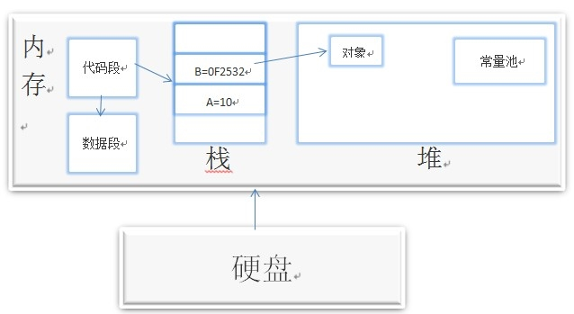

1、栈
保存局部变量，包括基本类型的值、堆区对象的引用
2、堆（垃圾回收）
存放动态生成的数据，如创建的对象（只包含对象的成员变量，不包含成员方法，因为方法是共享的）
3、常量池
常量的集合，类和接口的全名、
4、代码段
5、数据段，静态成员

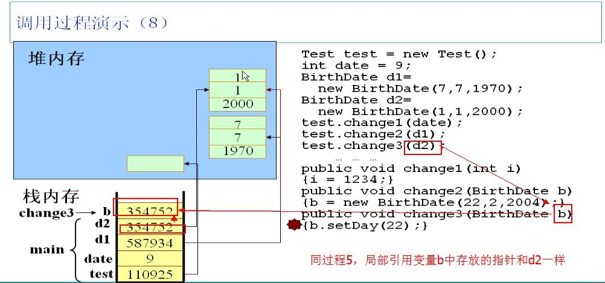
运行时数据区
    
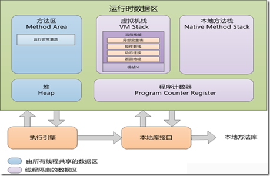    

||保存内容	|异常	|引发异常的情况|
|---|---------|------|-----------|
|程序计数器	|线程执行字节码的行号指示器	|无	|
|java虚拟机栈	|Java方法内存模型（方法执行时创建栈帧，存储局部变量表、操作栈、方法出口等信息）	|stackOverflowError栈深度OutOfMemoryError|回调函数深度太大（1000-200没问题）<br>创建的线程太多|
|本地方法栈|	Native方法	|stackOverflowError栈深度 OutOfMemoryError|同上|
|Java堆	|存放对象实例，所有线程共享 <br> 分代收集算法|OutOfMemoryError|list.add(new OOMbject())|
|方法区	|虚拟机加载的类信息、方法、接口、常量	|OutOfMemoryError| 大量的类|
|运行时常量池	|编译器生成的符号引用	|OutOfMemoryError |String.intern()|
|直接内存	| |OutOfMemoryError	|
程序计数器、虚拟机栈、本地方法栈。线程私有，与线程的生命周期相同。
java堆、方法区（包括运行时常量池），线程共享。

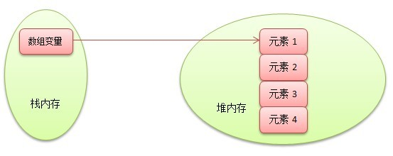

数组类型的内存分配，数组的引用在栈中，数组元素存放在堆中
Animal[] animal = new Animal[2];

##2.内存分配与回收
栈中的栈帧随着方法的进入和退出而有条不紊的出栈和入栈，内存的分配和回收具备确定性。

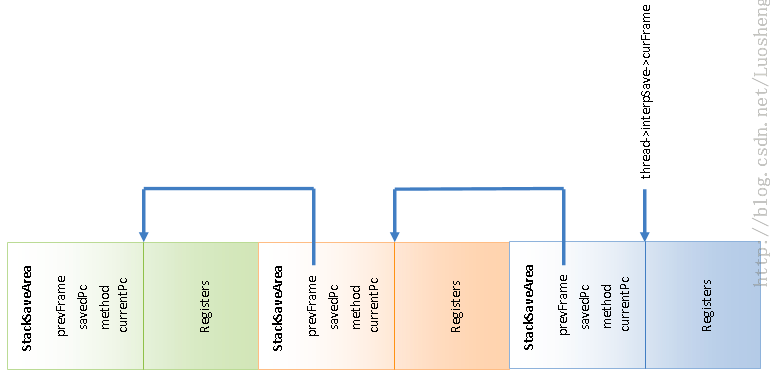

###判断对象是否存活的算法
1、引用计数法，对象添加一个引用计数器，当计数器为0时，对象不能再被引用。
缺陷是，对象之间的相互循环引用问题
public class ReferenceCountGC{
    public Object instance=null;
    private static  final int _1MB=1024*1024;
    private byte []bigSize=new byte[2*_1MB];
    public static void testGC(){
        ReferenceCountGC objA=new ReferenceCountGC();
        ReferenceCountGC objB=new ReferenceCountGC();
        
        objA.instance=objB;
        objB.instance=objA;
        
        objA=null;
        objB=null;
    }
}
2、根搜索算法
基本思想，从GC Roots作为起点，开始向下搜索，当一个对象从GC Roots不可达时，证明该对象不可用
GC Roots（堆中的对象实例在哪里可以引用）

* 虚拟机栈中的引用对象
* 方法区中的类静态属性引用对象
* 方法区的常量引用对象(用final修饰的常量，如final Test test=new Test())（注，如果用final修饰基本类型，则基本类型的值不能改变；修饰引用，则引用的地址不能改变）
* 本地方法栈中的JNI引用对象

两次标记过程
当对象与GC Root不可达时，第一次标记，并筛选出有必要执行finalize()方法的对象加入F-Queue队列，并由虚拟机创建的低优先级Finalizer线程触发该对象的finalize方法
然后会对F-Queue中的对象进行第二次小规模标记
对象可以在finalize方法中，重新与引用链的对象建立连接，从而拯救自己（这种对象只能拯救一次，因为finalize方法只能执行一次）
Public Class Test{
   public static Test SAVE=null;
    @Override
    protected void finalize() throws Throwable {
        super.finalize();
        SAVE=this;//调用finalize方法时，引用自己，从而拯救自己
    }
}
###垃圾收集算法
1、标记-清除
首先标记出所有需要回收的对象，标记完成后，统一回收掉所有标记的对象。
缺点，低效率和内存碎片
2、复制算法
内存均分为两块，只使用其中的一块
将存活的对象复制到另一块，然后开始使用该块内存
缺点，内存只有原来的一半
应用场景，回收新生代(minor GC)，因为IBM研究98%的新生代对象会马上死亡(朝生夕死，非常不稳定)，所有可以分配一块较大的Eden空间和两块较小的Survivor空间（比例是8：1），每次使用Eden空间和一块Survivor空间，当清理时，把Eden和Survivor中存活的对象复制到另一块Survivor空间，然后清理Eden和Survivor
3、标记-整理算法
所有存活的对象都向一端移动，一般用于回收老年代(major GC)
4、分代收集
对象的存活周期分为，新生代和老年代

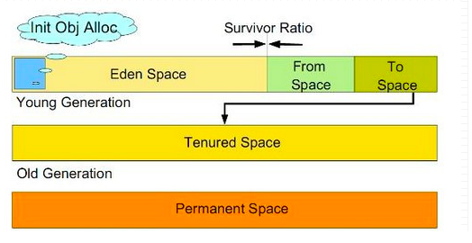

新生代存活率低，采用复制算法（熬过一次Minor GC，年龄+1，默认15岁到老年代），当 JVM 无法为一个新的对象分配空间时会触发 Minor GC。

老年代存活率高，采用标记清理或标记整理（大对象为了避免在Eden中复制，直接进入老年代），Major GC ，速度一般会比 Minor GC 慢 10倍以上。新生代晋升比老年代剩余空间大时，引发major GC
永久代，主要存放类定义，字节码，和常量等很少会变更的信息。并且永久代不会发生垃圾回收。

###引用

只负责回收堆内存中的对象，不会回收物理资源（如数据库连接、网络连接，因此需要在finalize()方法中释放）
强制回收

```java
System.gc();   //full GC
Runtime.getRuntime().gc();
```
垃圾回收之前，通常要求程序调用适当的方法清理资源，默认的方法是finalize()
任何类都可以重写Object类的finalize()方法，在该方法中清理该对象占用的资源

* 强引用：引用变量，通过引用变量访问实际对象

```java
Object obj=new Object();//强引用的对象永远不会被回收
```

* 软引用：有用但是非必须，内存不够时，只有软引用的对象会被回收
         内存溢出之前，将弱引用对象列入回收范围，如果还是没有足够的内存，则抛出内存溢出异常


```java
SoftReference<String> sr = new SoftReference<String>(new String("hello"));
System.out.println(sr.get());
```

* 弱引用：非必须对象，当垃圾回收器动作时，不管内存是否充足，总会被回收

```java
WeakReference<String> sr = new WeakReference<String>(new String("hello"));
System.out.println(sr.get());
```

* 虚引用：类似于没有引用，作用是该对象被回收时，收到一个系统通知。必须和ReferenceQueue联合使用，用于跟踪对象被垃圾回收的状态。ReferenceQueue保存被回收的对象引用，在释放之前，将虚引用添加到关联的引用队列，从而可以连接虚引用所引用的对象是否即将被回收。

```java
String str= "hello";
ReferenceQueue rq= new ReferenceQueue();
PhantomReference pr=new PhantomReference (str ,rq);
System.out.println(pr.get());//输出为null，因为无法通过虚引用获取对象
System.gc();
System.out.println(rq.poll==pr);//输出为true，对象被回收后，对应的虚引用被添加到关联的队列中
```

##3.Java内存模型

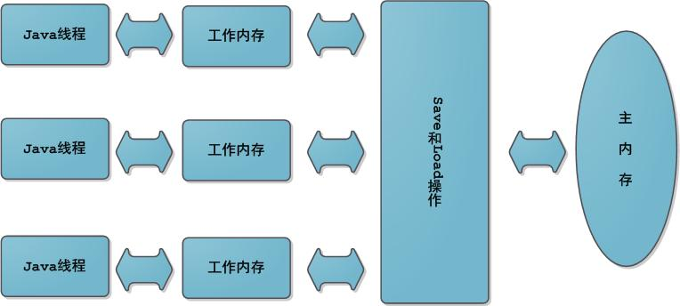

Java内存模型的主要目标是定义程序中各个变量的访问规则，即在虚拟机中将变量存储到内存和从内存中取出变量这样底层细节。Java 语言的内存模型由一些规则组成，这些规则确定线程对内存的访问如何排序以及何时可以确保它们对线程是可见的。
Java内存模型中规定了所有的变量都存储在主内存中，每条线程还有自己的工作内存（可以与前面将的处理器的高速缓存类比），线程的工作内存中保存了该线程使用到的变量到主内存副本拷贝，线程对变量的所有操作（读取、赋值）都必须在工作内存中进行，而不能直接读写主内存中的变量。
当线程访问某一个对象时候值的时候，首先通过对象的引用找到对应在堆内存的变量的值，然后把堆内存

变量的具体值load到线程本地内存中，建立一个变量副本，之后线程就不再和对象在堆内存变量值有任何关系，而是直接修改副本变量的值，

在修改完之后的某一个时刻（线程退出之前），自动把线程变量副本的值回写到对象在堆中变量。

volatile关键字修饰的变量表示线程修改后，强制马上写入主存，其他线程对该变量的引用失效，必须重新读取。

* 原子性，x++;不是原子操作，包括3个操作：读取x的值，进行加1操作，写入新的值。

* 可见性，　当一个共享变量被volatile修饰时，它会保证修改的值会立即被更新到主存，当有其他线程需要读取时，它会去内存中读取新值。

* 有序性，允许编译器和处理器对指令进行重排序

```java
public class Test {
    public volatile int inc = 0;
     
    public void increase() {
        inc++;
    }
     
    public static void main(String[] args) {
        final Test test = new Test();
        for(int i=0;i<10;i++){
            new Thread(){
                public void run() {
                    for(int j=0;j<1000;j++)
                        test.increase();
                };
            }.start();
        }
         
        while(Thread.activeCount()>1)  //保证前面的线程都执行完
            Thread.yield();
        System.out.println(test.inc);
    }
}
```

此程序的输出并不是10000，因为inc++不是原子操作。
java.util.concurrent.atomic包下提供了一些原子操作类，自增（加1操作），自减（减1操作）、以及加法操作（加一个数），减法操作（减一个数）进行了封装，如AtomicInteger
重排序类型包括：

* 编译器生成指令的次序，可以不同于源代码所暗示的“显然”版本。
* 处理器可以乱序或者并行的执行指令。
* 缓存会改变写入提交到主内存的变量的次序。

Dalvik垃圾回收

* 需求：
一方面要求Dalvik虚拟机能够准确标记出哪些对象是不再被引用的。
另一方面要求Dalvik虚拟机尽快地回收内存，避免应用程序长时间停顿（Gc线程消耗CPU资源）。
* 算法
Dalvik虚拟机使用Mark-Sweep算法来进行垃圾收集。顾名思义，Mark-Sweep算法就是为Mark和Sweep两个阶段进行垃圾回收。其中，Mark阶段从根集（Root Set）开始，递归地标记出当前所有被引用的对象，而Sweep阶段负责回收那些没有被引用的对象。
在Dalvik虚拟机中，由Active堆和Zygote堆组成

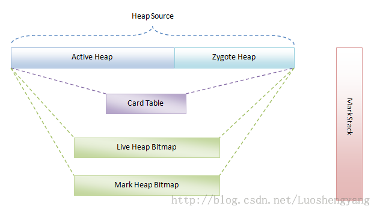

Zygote堆用来管理Zygote进程在启动过程中预加载和创建的各种对象（提高应用程序的启动速度），而Active堆是在Zygote进程fork第一个子进程之前创建的，Zygote堆指的是Fork进程之前，Zygote进程已经使用的内存空间。之后，都是在Active堆上进行对象分配和释放。
Card Table是记录在垃圾收集过程中对象的引用情况的。
Live Heap Bitmap，用来记录上次GC之后，还存活的对象。
Mark Heap Bitmap，用来记录当前GC中还存活的对象。（上次GC后存活的但是当前GC不存活的对象，就是需要释放的对象。）

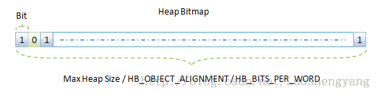

如果一个对象被引用，则对应的标记位为1，否则置0；
Android系统的第一个Dalvik虚拟机由Zygote进程创建，应用程序进程由Zygote进程fork出来，应用进程采用写时拷贝技术(初始状态应用程序进程和Zygote进程共享Zygote堆空间，如果应用程序或者Zygote对该空间进行写操作时，内核执行真正的拷贝操作)复制Zygote进程的地址空间。

* 非并行GC和并行GC
主要差别在于非并行GC在执行的过程中一直是挂起非GC线程的（需要在堆上分配空间，采用加锁的方式实现lock heap），而并行GC是有条件地挂起非GC线程。Stop-The-World
并行GC的Mark阶段又划分为两个子阶段，第一个子阶段只负责标记根级对象（全局变量、栈变量、寄存器引用的对象），第二个子阶段标记由根级对象引用的对象。第一个子阶段不允许运行其他线程，第二个子阶段允许运行。
Card Table记录非垃圾回收对象对垃圾回收对象的引用，避免正在被使用的对象被回收。

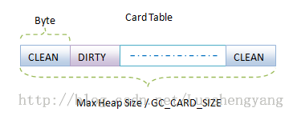

DIRTY表示对应的对象在Mark第二个子阶段被修改过。对于被修改过的对象，需要在第二个子阶段结束后，再次禁止GC线程之外的线程，以便根据被修改过的对象对其他对象的引用，重新标记。（由于第二个子阶段时间比较短，不会有太多的对象被修改，因此此时的停顿很小）
没有采用递归函数，而是借助Mark Stack，递归地标记对象的引用情况。
堆的起始大小（Starting Size）、最大值（Maximum Size）和增长上限值（Growth Limit）。在启动Dalvik虚拟机的时候，我们可以分别通过-Xms、-Xmx和-XX:HeapGrowthLimit三个选项来指定上述三个值。渐进的方法来为对象分配内存，直到达到最大值。

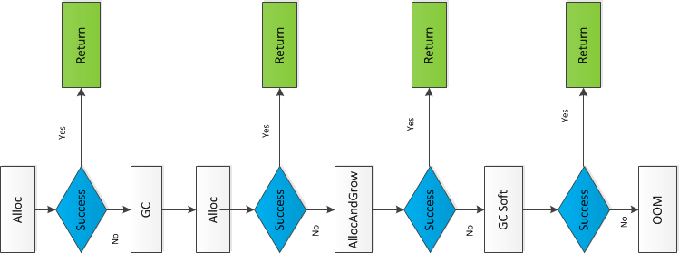

文件dalvik/vm/alloc/Heap.cpp中tryMalloc函数：

1. 调用函数dvmHeapSourceAlloc在Java堆上分配指定大小的内存。如果分配成功，那么就将分配得到的地址直接返回给调用者了。函数dvmHeapSourceAlloc在不改变Java堆当前大小的前提下进行内存分配，这是属于轻量级的内存分配动作。
2. 如果上一步内存分配失败，这时候就需要执行一次GC了。不过如果GC线程已经在运行中，即gDvm.gcHeap->gcRunning的值等于true，那么就直接调用函数dvmWaitForConcurrentGcToComplete等到GC执行完成就是了。否则的话，就需要调用函数gcForMalloc来执行一次GC了，参数false表示不要回收软引用对象引用的对象。
3. GC执行完毕后，再次调用函数dvmHeapSourceAlloc尝试轻量级的内存分配操作。如果分配成功，那么就将分配得到的地址直接返回给调用者了。
4. 如果上一步内存分配失败，这时候就得考虑先将Java堆的当前大小设置为Dalvik虚拟机启动时指定的Java堆最大值，再进行内存分配了。这是通过调用函数dvmHeapSourceAllocAndGrow来实现的。 
5. 如果调用函数dvmHeapSourceAllocAndGrow分配内存成功，则直接将分配得到的地址直接返回给调用者了。
6. 如果上一步内存分配还是失败，这时候就得出狠招了。再次调用函数gcForMalloc来执行GC。gcForMalloc(true) 表示要回收软引用对象引用的对象。
7. GC执行完毕，再次调用函数dvmHeapSourceAllocAndGrow进行内存分配。这是最后一次努力了，成功与事都到此为止。如果失败抛出，抛出一个OOM异常。

获取App最大内存

```java
ActivityManager activityManager=(ActivityManager)getSystemService(Context.ACTIVITY_SERVICE);
int memory=activityManager.getMemoryClass();//Nexus5 192M
```
如果GC线程空闲5S，会调用trimHeaps对已分配的堆内存进行裁剪。
Dalvik定义了四种类型的GC

* GC_FOR_MALLOC: 表示是在堆上分配对象时内存不足触发的GC。
* GC_CONCURRENT: 表示是在已分配内存达到一定量之后触发的GC。（空闲内存小于128K）
* GC_EXPLICIT: 表示是应用程序调用System.gc、VMRuntime.gc接口或者收到SIGUSR1信号时触发的GC。
* GC_BEFORE_OOM: 表示是在准备抛OOM异常之前进行的最后努力而触发的GC。


内存碎片问题
1. Android系统采用C库的dlmalloc内存分配器
2. 软限制（Soft Limit）的参数，每次GC之后，Dalvik虚拟机会根据Active堆已经分配的内存字节数、设定的堆目标利用率，重新计算Soft Limit
     主要是为了限制Active堆得增长，从而更有效的使用堆内存，有效减少内存碎片（如果一开始就将Active堆设置为最大值，那么已分配的内存可会遍布到很大的范围，随着内存的分配与回收，内存碎片就会越来越严重；如果施加Active堆得大小限制，已分配的内存就会集中在比较紧凑的范围，从而减少内存碎片）
     
     
内存泄露的原因
主要是因为对象已经不需要了，还保留其引用。如

* 长生命周期的对象持有短生命周期对象的引用，导致短生命周期对象无法被回收。


```java
public class MainActivity extends Activity {
    private static Drawable mDrawable; //静态的，会常驻内存，间接引用activity，导致activity无法GC
   
    @Override
    protected void onCreate(Bundle saveInstanceState) {        
        super.onCreate(saveInstanceState);
        setContentView(R.layout.activity_main);        
        ImageView iv = new ImageView(this);   //间接引用activity
        mDrawable = getResources().getDrawable(R.drawable.ic_launcher);
        iv.setImageDrawable(mDrawable);
    }
}
```

* 数据库连接（dataSourse.getConnection()），网络连接(socket)和io连接，除非其显式的调用了其close（）方法将其连接关闭，否则是不会自动被GC 回收的。一般都会在try里面去的连接，在finally里面释放连接。
避免内存泄漏：不要长生命周期的对象持有短生命周期对象的引用，实在不行，考虑采用弱引用。使用内部类时也要小心，因为非静态内部类会持有外部类的引用。
比如，集合类  List.add(new Object())，如果集合类不释放，则Object无法回收
           连接（数据库连接、网络连接、IO），需要显示调用close方法才能被回收


