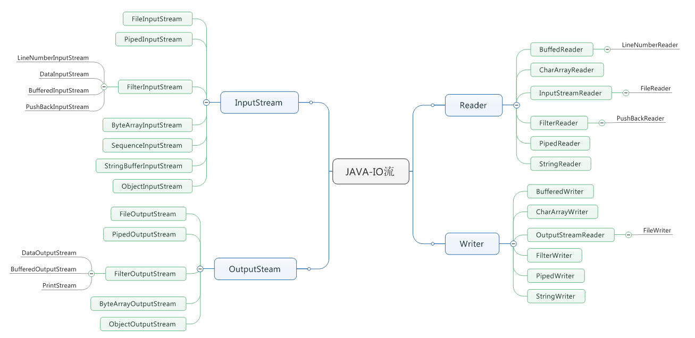

###1、File
既能够表示一个文件，又能表示一组文件（目录，可以调用list方法列出所有文件）

```
public class DirList {
    public static  void main(String args[])
    {
        File path=new File(".");
        String [] list;
        if(args.length==0)
            list=path.list();
        else
            list=path.list(new DirFilter(args[0]));
        Arrays.sort(list,String.CASE_INSENSITIVE_ORDER);
        for(String dirItem:list)
            System.out.println(dirItem);
    }
    static class DirFilter implements FilenameFilter
    {//过滤器
        private Pattern pattern;
        public DirFilter (String regex)
        {
            pattern=Pattern.compile(regex);//字符串编译成Pattern对象
        }
        public boolean accept(File dir,String name)
        {//list方法会回调accept方法
            return pattern.matcher(name).matches();//Pattern对象matcher方法生成Matcher对象，然后调用matches方法
        }
    }
}
```

###2、输入输出流
代表有能力产生数据的数据源对象或者有能力接收数据的接收端对象.  
如Inputstream或Reader派生的类都有read方法，用于读取单个字节或字节数组；
Outputstream或Writer的派生类都含有write方法，用于写单个字节或字节数组。
通常很少使用单个类创建流对象，而是通过叠合多个对象提供所期望的功能（装饰者模式），核心IO类型加上所有的装饰器，才能得到我们所希望的单个IO对象。



Inputstream表示由不同数据源产生的类

|类 |  功能 | 使用方法（构造器）|
|---|------|-----------------|
|ByteArrayInputstream  |  将内存缓存区当做Inputstream |缓存区|
|StringBufferInputstream |将String转换为Inputstream  | 字符串，底层采用StringBuffer实现|
|FIleInputstream| 从文件读取信息| 文件|
|PipedInputstream  |  实现管道化  | 多线程数据源|
|SequenceInputstream |将多个Inputstream合并为一个 |
|FilterInputstream  | 装饰器接口   |
Outputstream决定了输出的目标

|类 |  功能 | 使用方法（构造器）|
|---|------|-----------------|
|ByteArrayOutputstream |  将输出的内容放置在内存缓存区 | 内存缓存区|
|FileOutputstream   | 写入文件  |  文件|
|PipeOutputstream  |  管道输出   | 指定用于多线程的数据的目的地|
|FilterOutputstream  |装饰器接口  | 
FileterInputstream是为装饰器类提供基类,通过FilterInputStream从InputStream读取数据

|类 |  功能 | 使用方法（构造器）|
|---|------|-----------------|
|DataInputStream |从流中读取基本数据类型（int，char，long） | InputStream 包含用于读取基本数据的全部接口|
|BufferedInputStream |防止每次读取都进行实际的写操作 |InputStream，缓存区大小（可选）|
|LineNumberInputStream  | 跟踪输入流中的行号，可以调用getLineNumber()和serLineNumber()  | InputStream 仅增加了行号|
|PushbackInputStream |具有“能弹出一个字节的缓存区”，因此可以将读到的最后一个字符回退   | InputStream通常用于编译器的扫描器|

通过FilterOutputStream向OutputStream写入

|类 |  功能 | 使用方法（构造器）|
|---|------|-----------------|
|DataOutputStream   | 与DataInputStream搭配使用，可以写入基本数据类型 |OutputStream|
|PrintStream |用于产生格式化输出  | OutputStream|
|BufferedOutputStream  |  避免每次发送数据都要进行实际的写操作，可以调用flush()清空缓存区 |OutputStream，可以指定缓存区大小|

Reader和Writer为了提供了兼容Unicode与面向字符的IO功能，而设计。  
字节层次结构的类与字符层次结构的类结合：适配器

——InputstreamReader，把Inputstream转换为Reader    
——OutputstreamWriter，把Outputstream转换为Writer

无论何时使用readLine()，都不应该使用DataInputStream，而应该使用BufferedInputStream。


自我独立的类：RandomAccessFile，继承Object，构造器需要指示读写（“r”/"rw"）  
适用于由大小已知的记录组成的文件，可以使用seek方法在记录间移动，然后读取或修改记录。  
getFilePoint查询当前所处的文件位置
seek移动到新位置
length返回文件的大小

 
典型使用方式
1、读取文本文件

```
//打开文件用于字符输入，使用FileReader。为了提高速度，BufferedReader对文件进行缓冲。
    BufferedReader bufferedReader=new BufferedReader(new FileReader(fileName));
        String s;
        StringBuffer sb=new StringBuffer();
        while((s=bufferedReader.readLine())!=null)//一行一行读取
            sb.append(s+"\n");
        bufferedReader.close();
        return sb.toString();
    }
```
2、读取二进制文件

```
public static byte[] read(File file) throws IOException{
        BufferedInputStream bufferedInputStream=new BufferedInputStream(new FileInputStream(file));
        byte[] data=new byte[bufferedInputStream.available()];
        bufferedInputStream.read();
        bufferedInputStream.close();
        return data;
}
```
3、读写数据，DataInputStream以便阅读

```
DataOutputStream out = new DataOutputStream(new BufferedOutputStream(new FileOutputStream("data.txt")));
        out.writeDouble(3.1415926);
        out.writeUTF("That is PI");
        out.close();
        DataInputStream in=new DataInputStream(new BufferedInputStream(new FileInputStream("data.txt")));
        System.out.println(in.readDouble());//提供了一系列读写数据的方法，readByte/readFloat/readChar
        System.out.println(in.readUTF());
        
```
4、读写随机访问文件

```
public class UsingRandomAccessFile {
    static String file="rtest.dat";
    public static void main(String []args) throws IOException{
        RandomAccessFile rf=new RandomAccessFile(file,"rw");
        for(int i=0;i<7;i++)
            rf.writeDouble(i*1.414);
        rf.writeUTF("the end of the file");
        rf.close();
        rf=new RandomAccessFile(file,"rw");
        rf.seek(5*8);
        rf.writeDouble(47.001);
        rf.close();
        display();// 0.0 1.414 2.828 4.242 5.656 47.0001 ....
    }
}
```

* 通道

Java 1.4的java.nio.*包中引入了新的java I/O类库，通过通道和缓冲器（通道是包含煤层的矿藏，缓冲器是运送矿藏的卡车），从而快速移动大量数据，提高读写速度。   
通道是一种专门处理IO的处理器，它的作用是建立独立的IO操作，将CPU从繁多的低速IO操作中解脱。

与通道交互的缓冲器是ByteBuffer，构造器可以是具体的字节集合，也可以是大小

有三个类被修改，FileInputStream、FileOutputStream、RandomAccessFile

```
public class GetChannel {
    private static final int BSIZE=1024;
    public static void main(String [] args) throws IOException
    {
        FileChannel fileChannel=new FileOutputStream("data.txt").getChannel();
        fileChannel.write(ByteBuffer.wrap("something".getBytes()));
        fileChannel.close();
        
        fileChannel=new RandomAccessFile("data.txt","rw").getChannel();
        fileChannel.position(fileChannel.size());//移动到文件尾部
        fileChannel.write(ByteBuffer.wrap("something".getBytes()));
        fileChannel.close();
        
        fileChannel=new FileInputStream("data.txt").getChannel();
        ByteBuffer byteBuffer=ByteBuffer.allocate(BSIZE);
        fileChannel.read(byteBuffer);
        byteBuffer.flip();//调用read向ByteBuffer存储数据，必须调用flip让ByteBuffer做好让别人读取的准备
        while(byteBuffer.hasRemaining())
            System.out.print((char)byteBuffer.get());
    }
}

```

* 内存映射文件

内存映射文件（通常用于极大的文件，无法一次读入内存）
为了既能读又能写，由RandomAccessFIle获取文件上的通道，然后调用map产生MappedByteBuffer
只是把文件的一部分载入内存，文件的其他部分交换出去了，因此很大的文件（2G）也可以修改

```
public class LargeMappedFile  {
    static int length = 0x8FFFFF;
    public static void main(String []args) throws IOException {
        MappedByteBuffer out = new RandomAccessFile("test.dat", "rw").getChannel().map(FileChannel.MapMode.READ_WRITE, 0, length);
        for (int i = 0; i < length; i++)
            out.put((byte) 'x');
        for (int i = Length / 2; i < length / 2 + 6; i++)
            printnb((char) out.get(i));
    }
}
```

* 文件加锁

```
FileOutputStream fos=new FileOutputStream("file.txt");
FileLock fileLock=fos.getChannel().tryLock();//tryLock是非阻塞的，无法或得锁，则直接放回；Lock阻塞线程直到或得锁
if(fileLock!=null)
{
    ......
    fileLock.release();
}
fos.close();
```

* 映射文件部分加锁

对于很大的文件可以对文件的部分进行加锁，其他进程可以修改文件未被加锁的部分

```
public class LockAndModify extends Thread {
    private ByteBuffer byteBuffer;
    private int start,end;
    LockAndModify(ByteBuffer mbb,int start, int end)
    {
        this.start=start;
        this.end=end;
        mbb.limit(end);  //缓存区当前的终点，不能对超过终点的区域进行读写
        mbb.position(start);   //
        byteBuffer=mbb.slice();   //根据起始位置，建立子缓存区，共享部分数据
        start();
    }
    public void run(){
        try{
            FileLock fileLock=fileChannel.lock(start,end,false);
            //do something
            fileLock.release();
        }catch (IOException e){
            throw new RuntimeException(e);
        }
    }
}
```

* 对象序列化

对象序列化将那些实现了Serializable接口的对象转换成一个字节序列，并能够通过这个字节序列完全恢复原来的对象。  
对象序列化使java支持两种特性：  
		—RMI，当向远程对象发送消息时，需要通过对象序列化传递参数和返回值。  
      —Java Bean,对象序列化是必需的，因为使用Bean时，一般都是为了保存状态，因此必须能够序列化才能在后期恢复。  
对象序列化不仅保存了对象的“全景图”，还能够追踪对象内所包含的所有引用，并保存那些对象。  
要序列化一个对象，创建ObjectOutputStream对象，并调用writeObject方法即可将其序列化。反序列化，创建ObjectInputStream对象，并调用readObject方法。  
对一个Serializable对象进行还原的过程中，没有调用任何构造器，整个对象都是通过InputStream中取得数据恢复而来的。  
如果只有序列化后生成的文件，而没有相应的class文件，是无法进行发序列化的（抛出ClassNotFoundException）  
** 序列化的控制  
考虑到安全性问题，可能不希望对象的某一部分被序列化。  
可实现Externalizable接口，而不是Serializable接口，Externalizable继承Serializable接口，并添加了两个方法：writeExternal和readExternal。  
恢复Externalizable对象时，与Serializable不同，会调用默认的构造器，然后调用readExternal方法。

```
public class TestExternal implements Externalizable {
    private int i;
    private String s;
    public TestExternal(){
    }
    public TestExternal(int x,String ss)
    {
        i=x;
        s=ss;
    }
    @Override
    public void writeExternal(ObjectOutput out) throws IOException {
        out.writeObject(s);//在使用Externalizable接口时，没有任何东西会自动序列化，需要在writeExternal方法中将需要保存的信息写入
        out.writeInt(i);
    }
    @Override
    public void readExternal(ObjectInput in) throws IOException, ClassNotFoundException {
        s=(String)in.readObject();//在readEXternal方法中恢复数据
        i=in.readInt();
    }
}
```

对于某些不想实例化的字段或者瞬时状态字段（如Thread类），应该使用关键字transient标明。


