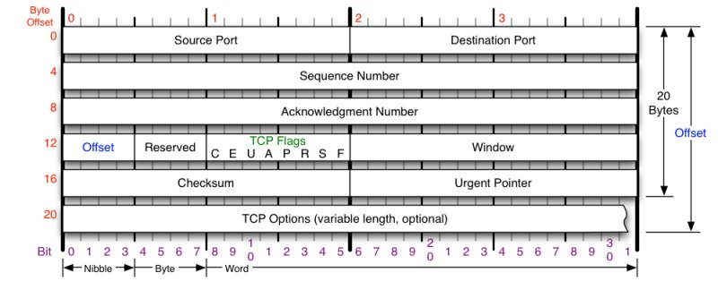
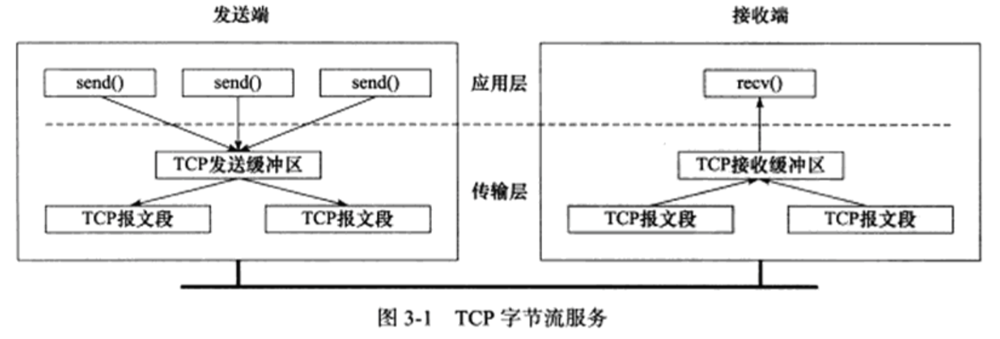
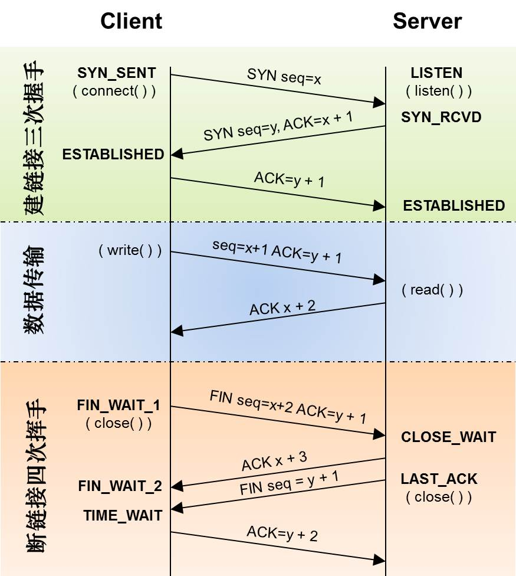
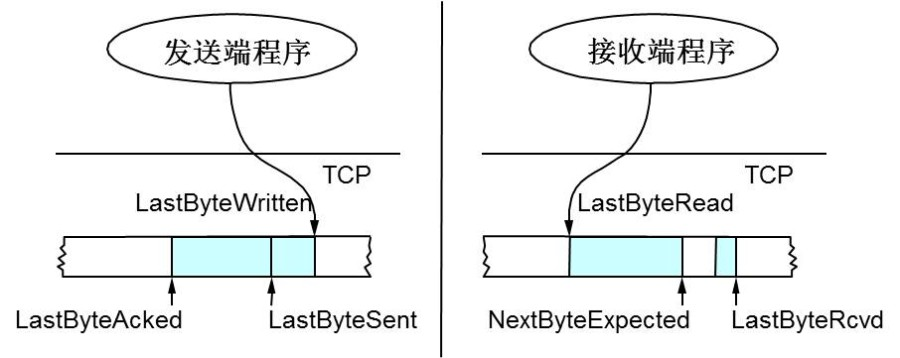
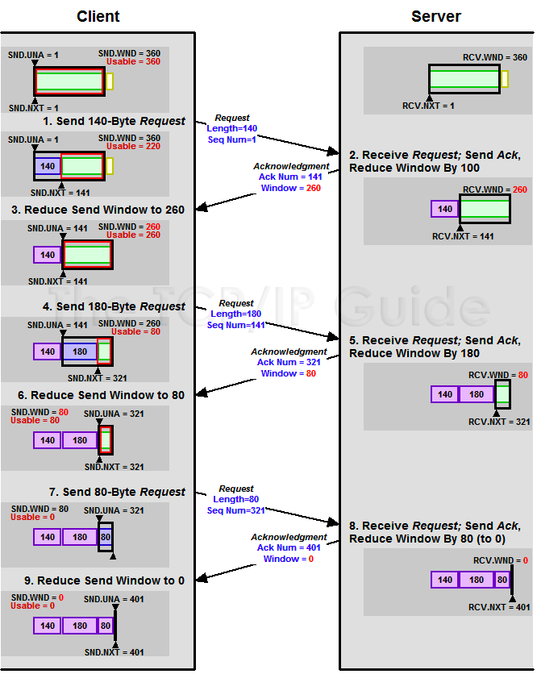
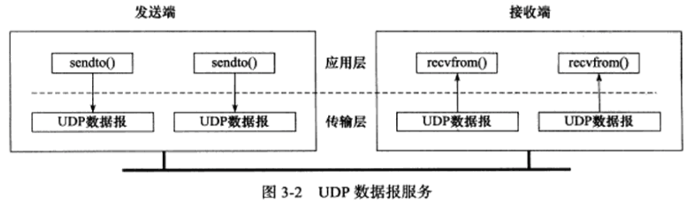
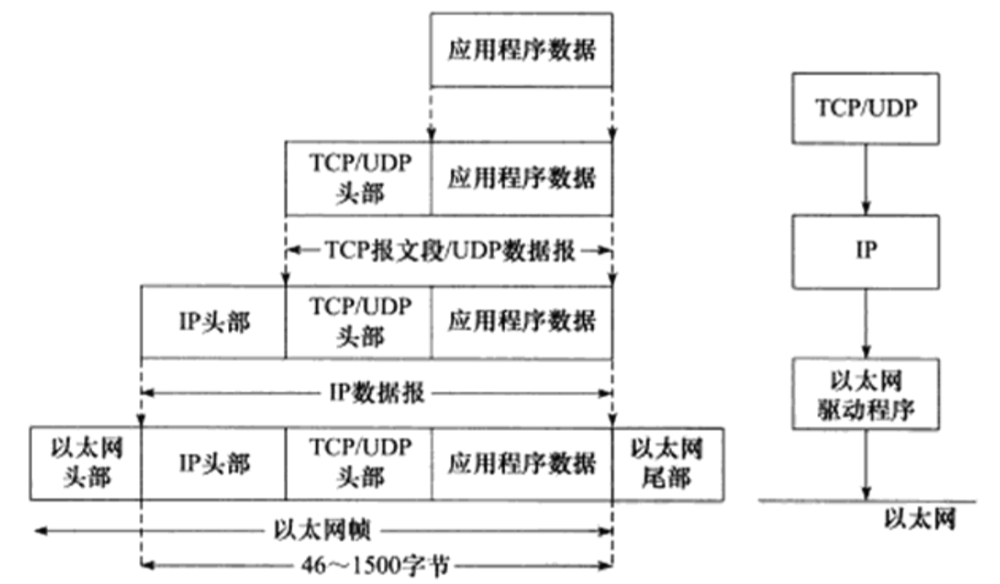
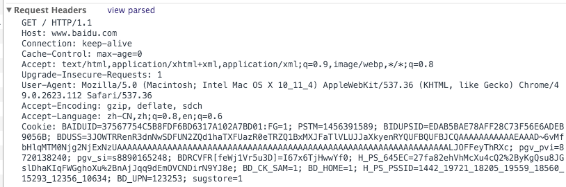
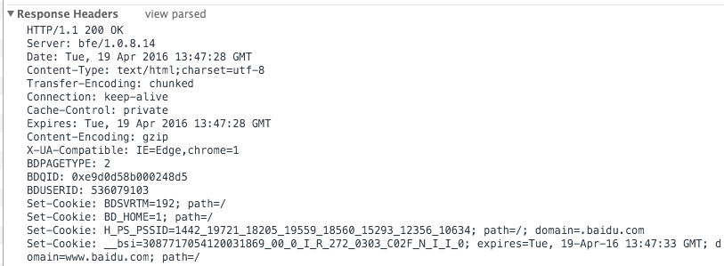

##1.数据链路层

实现了网卡接口的网络驱动程序，以处理数据在物理媒介（以太网、令牌环）上的传输。

常用的协议，ARP地址解析协议，RARP逆地址解析协议，实现了IP地址和MAC地址之间的转换。（网络层使用IP地址寻址，数据链路层使用物理地址寻址，因此网络层必须先将IP地址转化为物理地址，才能使用数据链路层的服务，这就是ARP协议的用途）

数据链路层封装的数据称为帧，比如，以太网上传输的称为以太网帧，令牌环网上传输的则是令牌环帧。

##2.网络层

实现数据报的选路与转发

* IP协议

IP为上层协议提供无状态、无连接、不可靠的服务。核心任务是数据报的路由（逐跳确定通信链路，决定发送数据报到目标地区的路径）
无状态，IP通信双方不同步传输数据的状态信息。所有的IP数据报的发送、传输、接收都是独立的，没有上下文关系。因此无法处理乱序、重复的数据报。
无连接，IP通信双方不会长久地维护双方的任何信息，每次发送数据都必须指明对方的IP地址。
不可靠，IP协议不保证IP数据报准确的到达接收端。

* ICMP协议

因特网控制报文协议，用于检测网络连接

##3.传输层

端到端的通信，只关心起始端和目的端，不关心数据包的中转过程。
TCP协议

面向连接、字节流、可靠传输、一对一、全双工



* 面向连接：通信双方必须建立TCP连接，并在内核中维护必要的数据结构，比如连接状态、读写缓存区、定时器。通信结束后，双方释放内核数据。
* 字节流：基于流的数据没有长度限制。发送端逐字节向数据流写入数据，接收端逐字节读取数据。
* 可靠传输：超时重传、数据确认

**TCP头格式**
Sequence Number，包序列号，用于解决包乱序的问题
Acknowledge Number，ACK，用于确认收到
Window，滑动窗口，用于解决流量控制
TCP Flag，包类型，用于操控TCP的状态机



当发送端程序发送数据时，数据被写入TCP发送缓存区。
当TCP模块真正发送数据时，发送缓存区中的数据被封装成TCP报文发出。
接收端程序接收到TCP报文后，TCP模块将它们携带的应用程序数据按照TCP报文的序号放入TCP接收缓存区，并通知应用程序读取数据。

ACK标记，确认报文
PSH标记，（push）提示接收端从TCP缓存区读走数据
RST标记，（reset）连接重置
SYN标记，（synchronous）同步报文，建立连接，三次握手
FIN标记，（finish）关闭连接



三次握手，初始化Sequence Number，通信双方要知道各自的Sequence Number（写入缓存区时的起始地址），图中的x，y，作为以后的数据通信序号，拼接数据，保证数据不会乱序。
断开连接4次挥手，发送方和接收方都需要Fin和ACK
TCP滑动窗口，可靠传输和包乱序。网络带宽和实际的处理速度，避免引起网络拥塞和丢包。（流量控制）



* 发送端的LastByteAcked指向了被接收端Ack过的位置（表示成功发送确认），LastByteSent表示发出去了，但还没有收到成功确认的Ack，LastByteWritten指向的是上层应用正在写的地方。

* 接收端LastByteRead指向了TCP缓冲区中读到的位置，NextByteExpected指向的地方是收到的连续包的最后一个位置，LastByteRcved指向的是收到的包的最后一个位置，我们可以看到中间有些数据还没有到达，所以有数据空白区。


**黑框表示滑动窗口**



1. 首先，发送1-140，接收端发送ACK，并把窗口大小设置为260
2. 然后，发送141-320，接收端发送ACK，并设置窗口大小为80
3. 然后，发送321-401，接收端发送ACK，并设置窗口大小为0，表示不要再发送数据
UDP协议
不可靠、无连接、基于数据报
* 无连接：发送端每次发送数据都明确指定接收端的地址

* 基于数据报：发送端每执行一次写操作，UDP模块将其封装成UDP数据报并发送。接收端必须一次性将所有内容全部读出，否则数据被截断。



发送端每执行一次写操作，UDP模块将其封装成UDP数据报并发送。
接收端必须及时针对每个UDP数据报执行读操作，否则会丢包。

##4.应用层

负责处理应用层的逻辑
数据链路层、网络层、传输层，这部分必须既稳定有高效，因此都是在内核空间实现。
应用层在用户空间实现，比如文件传输、网络管理。。
上层协议如何利用下层协议提供的服务：封装



http请求由三部分组成，分别是：请求行、消息报头、请求正文
HEAD方法与GET方法几乎是一样的，对于HEAD请求的回应部分来说，它的HTTP头部中包含的信息与通过GET请求所得到的信息是相同的。利用这个方法，不必传输整个资源内容，就可以得到Request-URI所标识的资源的信息。该方法常用于测试超链接的有效性，是否可以访问，以及最近是否更新。



Accept请求报头域用于指定客户端接受哪些类型的信息。
Authorization请求报头域主要用于证明客户端有权查看某个资源。
User-Agent请求报头域允许客户端将它的操作系统、浏览器和其它属性告诉服务器
在Java网络编程中，Http请求头的内容可以设置

```java
httpURLConnection.setConnectTimeout(5*1000);
httpURLConnection.setRequestMethod("GET");
httpURLConnection.setRequestProperty("Accept-Language","zh-CN");
HTTP响应也是由三个部分组成，分别是：状态行、消息报头、响应正文
```
* 1xx：指示信息--表示请求已接收，继续处理
* 2xx：成功--表示请求已被成功接收、理解、接受                            
	200 OK      //客户端请求成功             
	206断点续传  请求http头  Range:bytes=xxx-      响应头状态码206   Content-Range:bytes xxxx-/总大小 
* 3xx：重定向--要完成请求必须进行更进一步的操作
* 4xx：客户端错误--请求有语法错误或请求无法实现

  400 Bad Request  //客户端请求有语法错误，不能被服务器所理解
  401 Unauthorized //请求未经授权，这个状态代码必须和WWW-Authenticate报头域一起使用 
  403 Forbidden  //服务器收到请求，但是拒绝提供服务
   404 Not Found  //请求资源不存在，eg：输入了错误的URL
* 5xx：服务器端错误--服务器未能实现合法的请求
                500 Internal Server Error //服务器发生不可预期的错误
                503 Server Unavailable  //服务器当前不能处理客户端的请求，一段时间后可能恢复正常



Server响应报头域包含了服务器用来处理请求的软件信息。与User-Agent请求报头域是相对应的。

```java
response.setContentType("application/octet-stream");
response.addHeader("Content-Disposition", "attachment;filename="+URLEncoder.encode(filename, "UTF-8"));
response.addHeader("Content-Length", file.length()+"");
response.setContentLength(((Long)file.length()).intValue());
```
