###第一章 引论
#####递归的四条基本法则
1. 基准情形，无需递归就能解出。
2. 不断推进，对于需要递归求解的情形，每次递归都必须使得状况朝一种基本情形推进。
3. 设计法则
4. 合成效益法则，切勿在不同的递归中做重复工作。例如递归求解斐波那契数列就不是一个好主意。

Java泛型可以带有限制的通配符
例如：

```java
public static double totalArea(Collection<? extends Shape> arr)
```

***
###第二章 算法分析
对于算法的分析，主要考虑平均运行时间和最坏情况运行时间（代表在可能输入的情况下，算法性能的保证）
运行时间中的对数一般法则
如果一个算法用常数时间将问题的大小削减为其一部分（通常是1/2），则该算法的复杂度是O(logN);
如果使用常数时间只把问题减少一个常数的数量，那么这个算法的复杂度就是O(N).

```java
//求最大公因数，辗转相除法
public static long gcd(long m, long n)
{
        while(n!=0)
        {
            long rem=m % n;
            m=n;
            n=rem;
        }
        return m;
}
```
分析该算法的时间复杂度，由于结束条件为n=0（余数序列399、393、6、3、0）
但是看不出余数按照常数因子递减，可以证明两次迭代后，余数最多为原始值的一半。
因此迭代次数最多为2logN，因此时间复杂度为O(logN)
***
###第三章，表、栈和队列
#####Iterator接口
```java
public interface Iterator<E> {
    public boolean hasNext();
    public E next();
    public void remove();
}
```
#####Collection接口
```java
public interface Collection<E> extends Iterable<E> {
    public int size();
    public boolean add(E object);
    public void clear();
    public boolean contains(Object object);
    public boolean isEmpty();
    public boolean remove(Object object);
    public Iterator<E> iterator();
```
#####集合中的List
```java
//集合的三种遍历方式，其中iterator和增强版for循环是等效的，增强版for循环是用iterator实现的，复杂度为O(n)，但是get的方式复杂度是O(n²)
List<Integer> lstint = new ArrayList<Integer>();

// Iterator遍历一
Iterator<Integer> iterator = lstint.iterator();
while (iterator.hasNext())
{
 	int i = (Integer) iterator.next();
 	System.out.println(i);
}

// for循环
for (int i = 0; i < lstint.size(); i++)
{
 System.out.println(lstint.get(i));
}

// for循环加强版
for (Integer i : lstint)
{
 System.out.println(i);
}
```
PS：使用Iterator时的准则
如果对正在被迭代的集合进行结构上的改变（add、remove、clear），迭代器变得不合法（在其后使用该迭代器抛出ConcurrentModificationException），因此在需要立即使用迭代器的时候才应该获取迭代器。也是由于这个原因，尽量使用迭代器的remove方法，从而避免迭代器变得不合法。
标准库中，ArrayList和LinkedList
***
###第四章，树
UNIX目录结构为树型结构
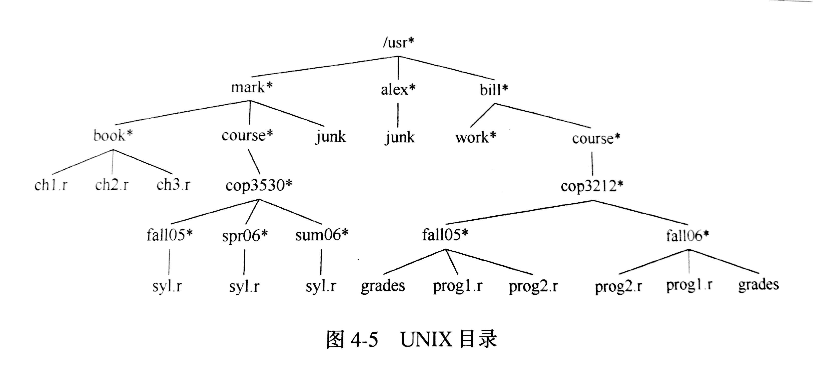
#####列出分级文件系统的目录（树的先序遍历）
#####计算文件目录的大小（树的后序遍历）
#####二叉查找树
若树中的每个节点都存储一项数据（自定义的类需要实现Comparable接口）
#####B树
当查询的数据集合保存在磁盘时，由于磁盘访问速度远远小于指令执行速度，因此需要尽量将比较次数降到最低（因为每做一次比较就需要从磁盘读取一次数据，查找树的高度降到最低）。将磁盘访问次数降到一个常数，二叉查找树的高度不能低于logN，想法是如果有更多的分支，树的高度就会越小。


 M阶，所有的非树叶节点的儿子数在[M/2，M]
 所有的树叶都在相同的深度并有[L/2，L]个数据项
* 对于M的选择，需要根据节点的大小限制确定，因为节点有M-1个关键字（M个分支）时，节点大小=关键字大小*（M-1）+M*分支大小；主要的限制在于节点大小不能超过磁盘区块大小（分配单元，旧称“簇”，每个单元地址划分的空间。如果超过磁盘区块大小，则需要进行多次磁盘访问）
* 对于L的选择，主要限制在于数据项的大小不能超过磁盘区块，因此数据项不能太多。
因此B树主要用于数据结构过大，无法保存在主存中，而是需要保存在磁盘。因此需要尽可能减小磁盘的访问次数。
List容器如ArrayList和LinkedList用于查找效率很低
Set，不允许有重复的集合
标准库中，TreeSet和TreeMap支持基本的add、remove、contains以对数最坏时间完成，基本的实现方法是平衡二叉查找树，但是更经常使用自顶向下的红黑树。
#####红黑树
根节点为黑色，整个树黑色平衡，近似平衡二叉查找树（放宽平衡的限制，具有更好的统计性能），为了解决二叉查找树（输入有序时）退化为链表的情况。
```
//Set的遍历，iterator = treeSet.iterator();     map的遍历  iterator = treeMap.keySet().iterator();
Map<String ,Double> scores=new TreeMap<String ,Double>();
scores.put("zhangsan",89.0);
scores.put("lisi",81.5);
scores.put("wangwu",87.0);
System.out.println(scores);   //输出结果为{lisi=81.5, wangwu=87.0, zhangsan=89.0}，按照名字的升序排列
```
#####树的遍历
|遍历方法|图示|关键代码|
|------------|:------|------------|
|先序遍历（根-左-右）| 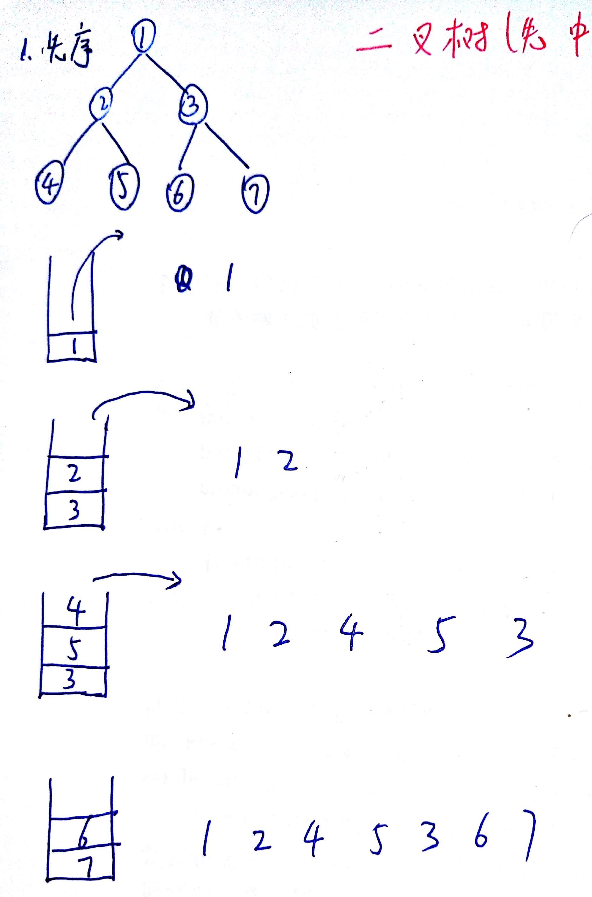 | 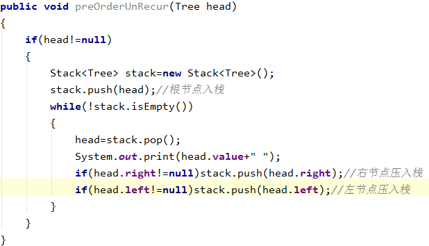      |
|中序遍历（左-根-右）| 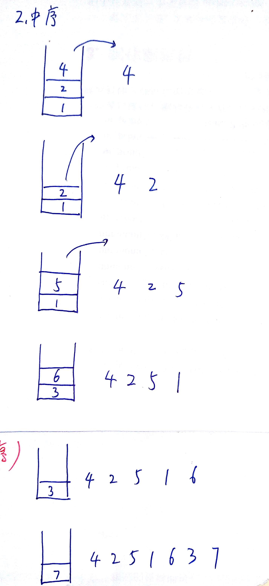 |  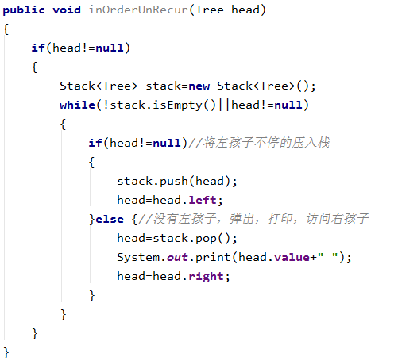       |
|后序遍历（左-右-根）| 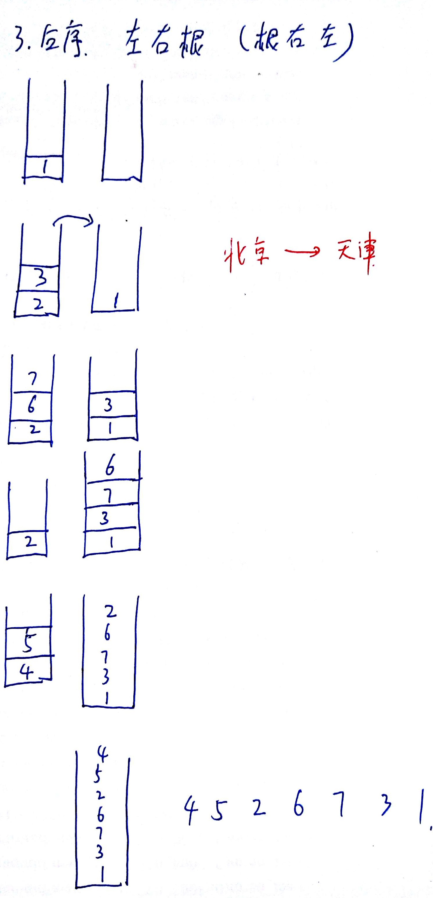|  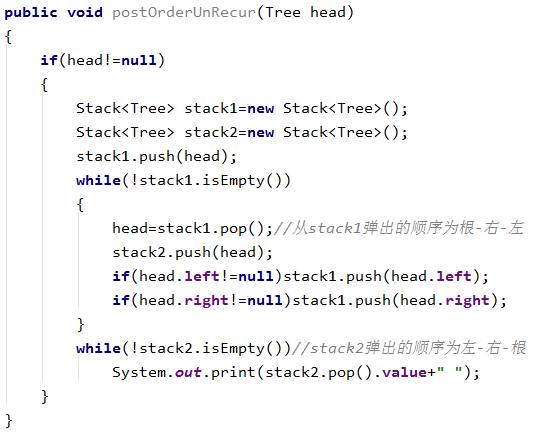    |
 
 
 
PS：按层遍历
如果需要记录层次信息
* 可以用两个变量记录当前层待打印节点的个数curLevelCount，下一层节点总数nextLevelCount。当curLevelCount==0时，表示当前层节点已经全部打印。
* 也可以用两个队列，第一个队列保存当前层所有节点，第二个队列保存下一层所有节点。

###第五章，散列
散列是一种用于以常数平均时间执行插入、删除、查找的技术，但是它不支持元素间的排序
java标准库中的散列HashSet和HashMap，HashSet中的项必须提供equals方法和hashCode方法，通常采用*分离链接*的方式解决冲突。

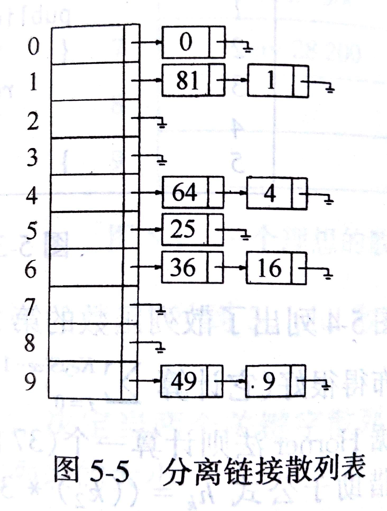
#####冲突解决：
1. 分离链接
装填因子接近于1时，可以提高空间利用率。
其缺点在于分配新的内存空间需要时间，导致算法的速度减慢。
2. 探测散列表（尝试另外一些单元）
装填因子应该低于  λ<0.5
* 线性探测
* 平方探测
标准库中，hashMap和HashSet
PS:在使用hash时，应注意复写equals和hashcode方法，因为hashmap要求key唯一，hashset要求不能有重复
hashSet是通过包装hashMap来实现的

```java
// 定义一个虚拟的 Object 对象作为 HashMap 的 value  
 private static final Object PRESENT = new Object();   
public boolean add(E e)  
 {  
     return map.put(e, PRESENT) == null;  
} 
```
###第六章，堆
堆（也叫优先队列），是一棵完全二叉树，它的特点是父节点的值大于（小于）两个子节点的值（分别称为大顶堆和小顶堆）
由于完全二叉树具有良好的性质（任意序号为i的节点，左儿子2i，右儿子2i+1，其父节点i/2），因此完全二叉树的存储不需要链式结构，可以用数组来实现。
一个堆，可以由一个（Comparable对象的）数组和一个当前堆大小的整数表示。
##### 构造初始堆 a[]={16,7,3,20,17,8}
首先生成完全二叉树

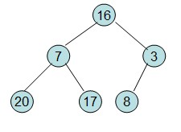

从最后一个非叶节点开始调整

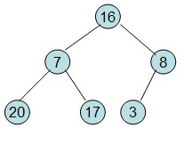  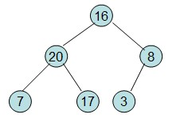  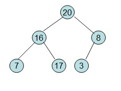
                     
#####最小堆的插入操作（为了不破坏堆的完全二叉树性质，首先需要在增加一个空节点，然后将插入的值移动到合适的位置，*上滤*）

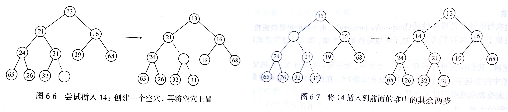
##### 最小堆的删除根节点操作

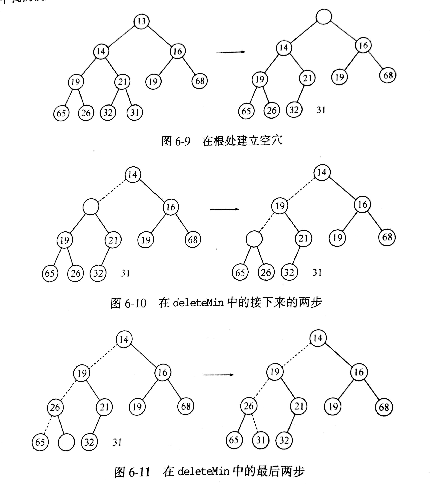

标准库中，在java 1.5之后加入泛型类PriortyQueue。
#####PriortyQueue本质上是最小堆。
 

###第七章，排序
外部排序，元素个数较大，排序工作不能再内存中完成，必须在磁盘完成。
判断一个排序是否稳定要看算法中每一次循环中比较的步长，如果步长大于1，就是不稳定的。
稳定排序：冒泡、插入、归并
不稳定：希尔排序、快速排序、堆排序

对于自定义的数据类型，他们的大小比较定义需要实现comparator接口。

```java
public class Test {
    private String name;
    private int population;
    public int getPopulation() {
        return population;
    }
    public Test(String name,int population)
    {
        this.name=name;
        this.population=population;
    }
    public static void main(String []args)
    {
        Comparator<Test> OrderIsdn =  new Comparator<Test>(){
            public int compare(Test o1, Test o2) {
                int numbera = o1.getPopulation();
                int numberb = o2.getPopulation();
                if(numberb > numbera)
                {
                    return -1;
                }
                else if(numberb<numbera)
                {
                    return 1;
                }
                else
                {
                    return 0;
                }
            }
        };
        Queue<Test> priorityQueue =  new PriorityQueue<Test>(11,OrderIsdn);
        Test t1 = new Test("t1",1);
        Test t3 = new Test("t3",3);
        Test t2 = new Test("t2",2);
        Test t4 = new Test("t4",0);
        priorityQueue.add(t1);
        priorityQueue.add(t3);
        priorityQueue.add(t2);
        priorityQueue.add(t4);
        while(!priorityQueue.isEmpty())
        {
            System.out.println(priorityQueue.poll().getPopulation());//输出结果为0,1,2,3
        }
    }
}
```
PS：compare方法不一定要返回-1,1,0；只要是负数、正数、0就可以

```java
compare(Entry<Character, Integer> e1,Entry<Character, Integer> e2) {
    int num = e1.getValue() - e2.getValue();
    if(num!=0)
    return num;
    return e1.getKey() - e2.getKey();
} 
```

#####冒泡排序（稳定）
从下往上扫描数组：凡扫描到违反本原则的轻气泡，就使其向上"飘浮"。如此反复进行，直到最后任何两个气泡都是轻者在上，重者在下为止。

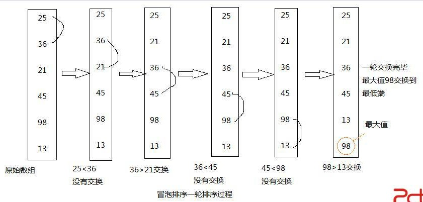

##### 插入排序（稳定）

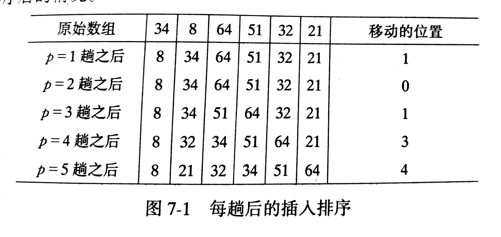

代码

```java
    /*
        泛型参数
        “?”代表任意类型。如果只指定了<?>，而没有extends，则默认是允许任意类。
        extends关键字声明了类型的上界，表示参数化的类型可能是所指定的类型，或者是此类型的子类。
        super关键字声明了类型的下界，表示参数化的类型可能是所指定的类型，或者是此类型的父类型，直至Object
        Comparable<T>
        Interface之间可以继承，如下
            Intreface A
            Interface B extends A
     */
private <AnyType extends Comparable<? super AnyType>> void insertionSort(AnyType [] a)
{
    int j;
    for(int p=1;p<a.length;p++)
    {
        AnyType tmp= a[p];
        for(j=p;j>0&&tmp.compareTo(a[j-1])<0;j--)
            a[j]=a[j-1];
        a[j]=tmp;
    }
}
```
插入排序的时间复杂度是O(N²)
#####希尔排序（不稳定，例如  {3,2，2,4}，间距为2时，{2,2,3,4}  3和2交换导致，后面的2交换到前面2的前面）

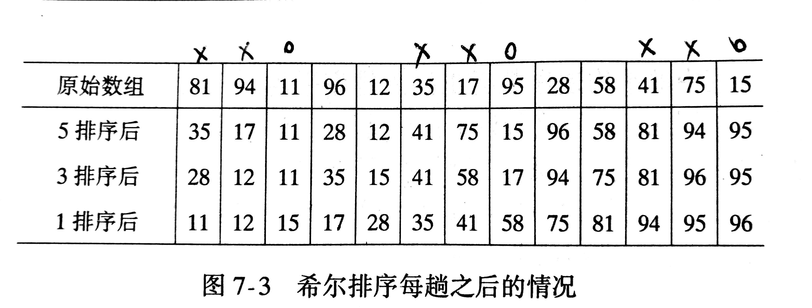

一趟hk排序就是对hk个独立的子数组进行一次插入排序，如5排序
{81,35,41}
{94,17,75}
{11,95,15}
{96,28}
{12,58}

```java
/*
        增量序列的选择，N/2，N/4，......，1
        Hibbard序列：1,3,7,.....2ⁿ-1       时间复杂度为O(N3/2)  
        Sedgewick提出几种序列：1,5,19,41,109........       4i-3*2i+1     时间复杂度O(N4/3) 
   */
    private <AnyType extends Comparable<? super AnyType>> void shellSort(AnyType [] a)
    {
        int j;
        for(int gap=a.length/2;gap>0;gap/=2)
        {
            for(int i=gap;i<a.length;i++)
            {//
                AnyType tmp=a[i];
                for(j=i;j>=gap&&tmp.compareTo(a[j-gap])<0;j-=gap)
                    a[j]=a[j-gap];
                a[j]=tmp;
            }
        }
    }
```

##### 堆排序（不稳定）
第一步，线性时间建立一个大顶堆
第二步，执行N-1次deleteMax操作，将堆的最后一个元素与第一个元素交换，并进行下滤
第三步，算法终止时，数组为升序排列

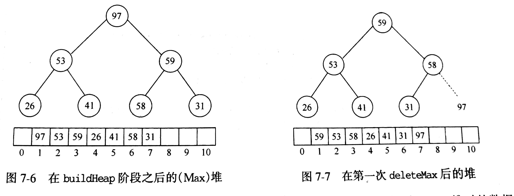

```java
private <AnyType extends Comparable<? super AnyType>> void heapSort(AnyType [] a)
{
    //从最后一个非叶结点开始调整，从而创建堆
    for(int i=a.length/2;i>0;i--)//节点序号：1,2.。。。N，节点N的父节点号N/2，是最后一个非叶结点
        perDown(a,i,a.length);
    for(int i=a.length-1;i>0;i--)
    {//删除N-1次，删除后堆中的最后一个节点补上
        swap(a,1,i);
        perDown(a,1,i);
    }
}
/*
    @int i  下滤的位置perlocate down
    @int n   堆大小
 */
private <AnyType extends Comparable<? super AnyType>> void perDown(AnyType [] a,int i,int n)
{
    int child;
    AnyType tmp;
    for(tmp=a[i];2*i<n;i=child)
    {
        child=2*i;
        if(child!=n-1&&a[child].compareTo(a[child+1])<0)//child为左孩子，此行代码的含义是找出左、右孩子中的较大者
            child++;
        if(tmp.compareTo(a[child])<0)
            a[i]=a[child];
        else break;
    }
    a[i]=tmp;
}
```
堆排序的时间复杂度O(NlogN)
##### 归并排序（稳定）
算法的基本操作是合并两个已排序的数组

```java
    private <AnyType extends Comparable<? super AnyType>> void mergeSort(AnyType [] a,int left,int right)
    {
        if(left<right)
        {
            int i=(left+right)/2;
            mergeSort(a,left,i);
            mergeSort(a,i+1,right);
            merge(a,left,i,right);
        }
    }
    private <AnyType extends Comparable<? super AnyType>> void merge(AnyType [] a,int left,int middle,int right) {
        AnyType[] tempArray = (AnyType[]) new Comparable[a.length];
        int tmpPos = left;
        int leftEnd = middle;
        while (left <= leftEnd && middle <= right)
            if (a[left].compareTo(a[right]) < 0)
                tempArray[tmpPos++] = a[left++];
            else
                tempArray[tmpPos++] = a[right++];
        while (left <= leftEnd)
            tempArray[tmpPos++] = a[left++];
        while (middle <= right)
            tempArray[tmpPos++] = a[middle++];
    }
```
 归并排序的时间复杂度O(NlogN)，其缺点在于合并两个已排序的数组需要线性内存空间。
##### 快速排序（不稳定）

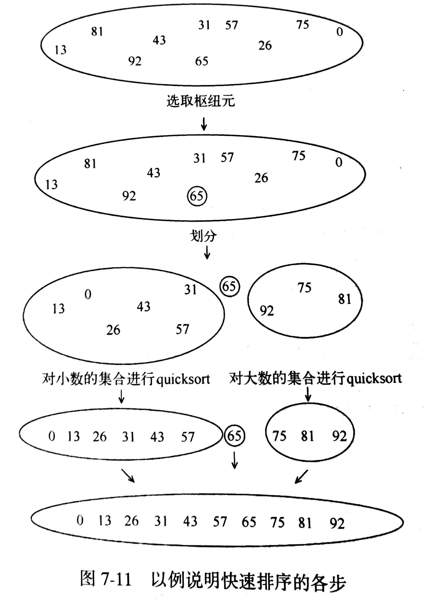

* 选取枢纽元

通常的做法是将第一个元素作为枢纽元，但是对于输入是预排序的情况，所有的元素被划分到一个集合中，这时快速排序的时间复杂度为O(N²)
三数中值分割法
选取输入的左端、右端和中心位置这三个数的中值作为枢纽元，例如输入{8,1,4,9,6,3,5,2,7,0}，左边元素为8，右边元素为0，中间位置为6，{0,6,8}，因此选择6作为枢纽元。
对于输入个数很小的情况，快速排序不如插入排序，不仅如此，因为快速排序是递归的，所有这种情况会经常出现，解决的方法是当N<10时，不使用递归的快排，而是使用插入排序。

```java
private <AnyType extends Comparable<? super AnyType>> void quickSort(AnyType [] a,int left,int right) {
    if(left<right)
    {
        int pivoLoc=partition(a,left,right);
        quickSort(a,left,pivoLoc-1);
        quickSort(a,pivoLoc+1,right);
    }
}
/*
    交换位置，使关键字到位，并返回其所在的位置
*/
private <AnyType extends Comparable<? super AnyType>> int partition(AnyType [] a,int left,int right) {
    AnyType pivotKey=a[left];
    while(left<right)
    {
        while(left<right&&a[right].compareTo(pivotKey)>=0)right--;
        a[left]=a[right];
        while(left<right&&a[left].compareTo(pivotKey)>=0)left++;
        a[right]=a[left];
    }
    a[left]=pivotKey;
    return left;
}
```
快速排序的最坏时间复杂度O(N²)，最好情况时间复杂度O(NlogN)，平均情况O(NlogN)。
* 只使用元素间比较的任何排序算法均需要Ω(NlogN)次比较 *
因为对于N个元素排序的决策树必然有N!个叶节点，决策树的高度至少为log(N!)=log（N(N-1)(N-2)......）=Ω(NlogN)
##### 桶式排序
当输入的数据维持在一个很小的范围时，可以使用桶式排序。
如：输入数据A1   A2    ...... AN，由小于M的正整数组成，那么可以使用一个大小为M的数组。当读入 Ai时，count[ Ai]增1，输入结束时，输出count数组即可。时间复杂度为O(M+N)
##### 基数排序
10个桶，首先以个位数的值进行装桶,即个位数为1则放入1号桶,为9则放入9号桶,暂时忽视十位数

|元素|  0  |  0  | 62 |  0  | 14 |  0  | 16 |  0  |  88 | 59 |
|---|----|-----|----|------|-----|-----|-----|-----|-----|-----|
|桶编号|  0  |  1  |  2  |  3  |  4  |  5  |  6  |  7  |  8   |  9  |

将桶里的数字顺序取出来，输出结果:[62,14,16,88,59]
以十位数的数字为准,进入相应的桶

|元素|  0  | 14,16 |  0  |  0  |  0  | 59 | 62  | 0  | 88  |  0  |
|---|----|-----|----|------|-----|-----|-----|-----|-----|-----|
|桶编号|  0  |   1      |  2  |  3  |  4  |  5  |  6  |  7  |  8   |  9  |

###第八章，图论
#####图的表示
1. 邻接矩阵
对于每条边(u,v)，置A[u][v]为true
2. 邻接表
如果图是稀疏的，更好的解决办法是邻接表

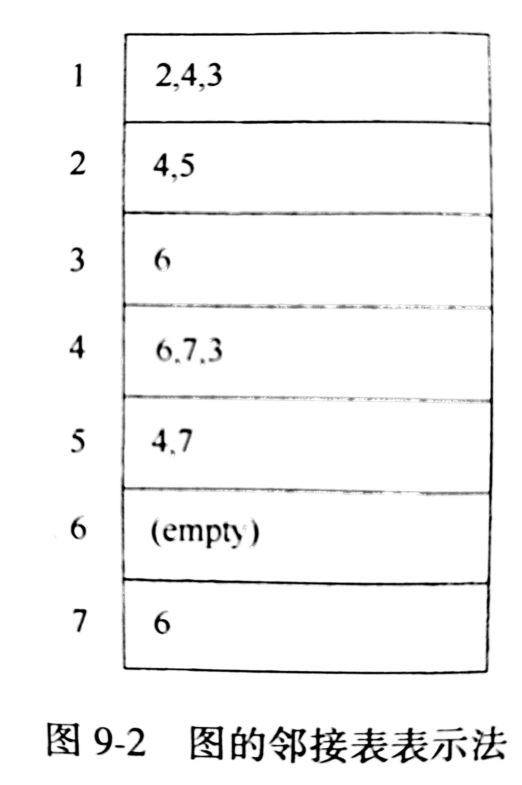

 为每个顶点建立一个链表，如(1,2)表示节点1到节点2有边。
邻接表可以用List保存，值得注意的是对于非常稀疏的图，当使用ArrayList时，需要从一个比默认容量更小的容量开始，否则会造成明显的空间浪费。
#####拓扑排序
对无圈图的顶点排序，使得如果存在一条从Vi到Vj的路径，那么排序中Vj出现在Vi后面。
拓扑排序的应用——课程安排（计算机系统概论是数据结构与算法的先修课），课程之间的关系可以用图来表示
1. 一个简单的求拓扑排序的算法
找出任意一个没有入边的顶点
将该顶点其边从图中删除
然后对其余部分按照同样的方法处理
2. 算法改进
算法1在删除某个顶点后，虽然只有少数顶点的入度发生变化，但是需要扫描所有顶点
首先，对每个顶点计算其入度，将入度为0的节点加入队列
其次，当队列不为空时，删除一个顶点，并将与其邻接的顶点入度减1,将入度为0的节点加入队列
*当前还不存在找出从s到一个顶点的路径比找出从s到所有顶点路径更快的算法*
#####最短路径算法
1. 单源最短路径（找出从特定顶点s到图G中其他顶点的最短赋权路径）
* 广度优先搜索求无权最短路径
算法步骤：先找出从s出发距离为1的顶点集合；然后距离为2的顶点（也就是说相距距离为1的顶点距离为1的顶点）。。。。。。

```java
    private void unWeighted( Vertex s)
    {
        Queue<Vertex> q=new Queue<Vertex>();
        for each Vertex v
            v.dist=INFINITY;
        s.dist=0;
        s.enqueue(s);
        while(!q.isEmpty())
        {
            Vertex v=q.dequeue();
            for each Vertex w adjacent to v           //v的邻接点
                if(w.dist==INFINITY)
                {
                    w.dist=v.dist+1;
                    w.path=v;
                    q.enqueue(w);
                }
        }
    }
```
* Dijkstra算法求赋权图的单源最短路径

```java
public class Vertex {
    public List adj;
    public boolean known;
    public DistType dist;
    public Vertex path;
 
    void dijkstra(Vertex s)
    {
        for each Vertex v
        {
            v.dist=INFINITY;
            v.known=false;
        }
        s.dist=0;
        for(;;)
        {
            Vertex v =smallest unknown distance vertex;
            if(v == NOT_A_VERTEX)
                break;
            v.known=true;
            for each Vertex w adjacent to v
                if(!w.known)
                    if(v.dist+cvw<w.dist)
                    {
                        //update w  更新为最短
                        w.dist=v.dist+cvw;
                        w.path=v;
                    }
        }
    }
 
}
```
对于具有负边值的图，Dijkstra算法不再使用，因为可能存在某个unknown节点使得某个known节点的路径长度更短。
#####最小生成树
解决用最少的电线给房子安装电路等问题
1. Prim算法
 
 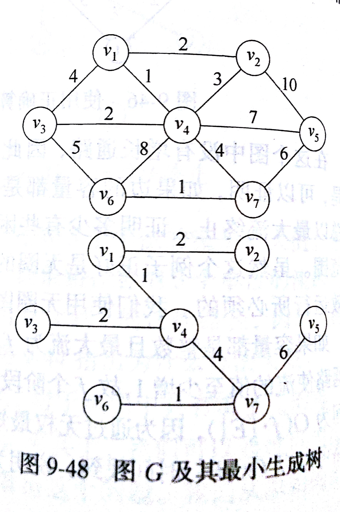	 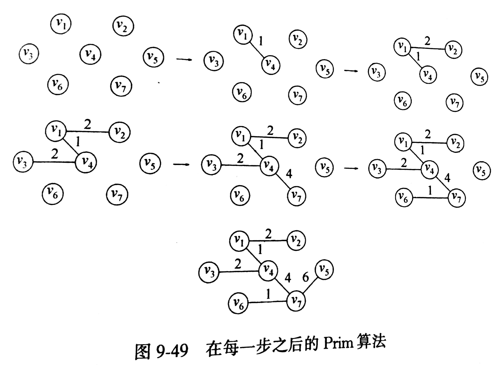

                        
 算法思路（贪心算法）
开始时，节点v1在构建的树上，然后找出可以把其他节点添加到树上的最短边
因此，{v1,v4}在树上
最后所有的节点 都被添加到树上。
2. Krusal算法
按照最小的权选择边，并且当选择的边不产生圈时，将其加入。

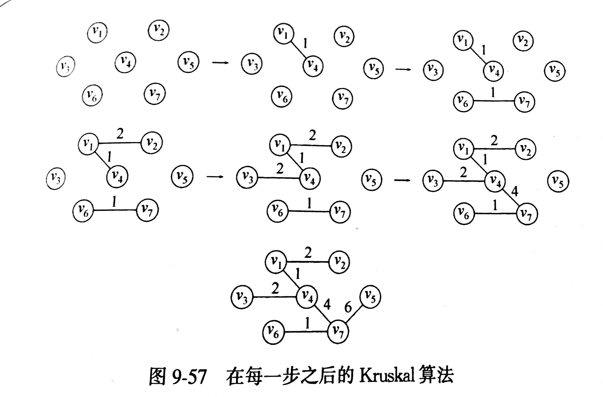

 ###第九章，算法设计
#####贪心算法
1.  文件压缩——哈夫曼编码（经常出现的字符，编码最短）
每次都是找出根节点值最小的两个节点，然后组成新节点。

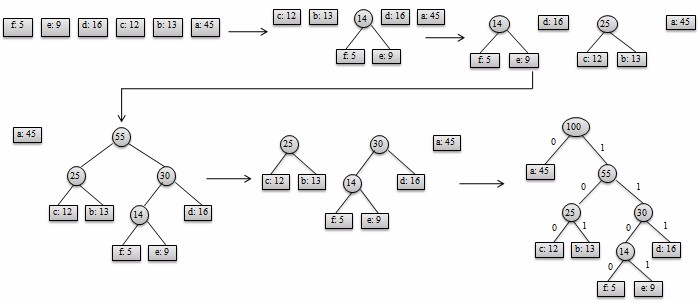

压缩文件的开头必须传送编码信息，否则将不能解码。对于一些小文件，传送编码信息的代价超过压缩的节省，最后结果将是文件扩大。
2. 背包问题
一艘载重量为c的轮船。其中集装箱i的重量为Wi。尽可能多的装集装箱
基本思路：最轻的集装箱先装
#####分治算法
分：递归解决较小问题
治：从子问题的解构建原问题的解
归并排序，每个问题均成为原问题大小的一半，然后用O(N)的附加工作（归并）
因此
        T(N)=2T(N/2)+O(N)
T(N)=O(NlogN)
#####动态规划
由于递归算法的效率问题，需要将递归算法改写成非递归算法，将*子问题的答案保存起来*
1. 最长公共子序列（可以不连续）

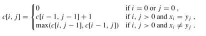
将第一行、第一列初始化为0，然后判断第i个字符和第j个字符是否相同，如果相同则c[i，j]=c[i-1，j-1]+1,；如果不相同，c[i，j]=max(c[i，j-1],c[i-1，j])
2. 最长公共子串（必须连续）

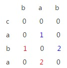

因为最长公共子串必须连续，因此最长公共子串是斜线最长的部分，如果将矩阵初始化为全0，则有matrix[i][j] = matrix[i-1][j-1] + 1;
然后用一个变量保存最大长度max

```java
public int findLongest(String A, int n, String B, int m) {
        if(n == 0 || m == 0){
            return 0;
        }
        //初始化状态矩阵
        int[][] matrix = new int[n][m];
        for(int i = 0; i < n; i++){
            for(int j = 0; j < m; j++){
                matrix[i][j] = 0;
            }
        }
        int max = 0;
        for(int i = 0; i < n; i++){
            for(int j = 0; j < m; j++){
                if(A.charAt(i) == B.charAt(j)){
                    if(i == 0 || j == 0){
                        matrix[i][j] = 1;
                    }else{
                        matrix[i][j] = matrix[i-1][j-1] + 1;
                    }
                    max = (max > matrix[i][j] ? max : matrix[i][j]);
                }
            }
        }
        return max;
}
```
#####回溯算法（深度优先搜索）
 很多情况下，回溯算法相当于穷举搜索算法的巧妙实现。可以根据实际情况进行剪枝或者找到一个合适的解时程序结束，从而减少时间复杂度。
深度优先搜索解空间树的方法有两种
1. 迭代回溯

```java
private void iterativeBackTrack()
{
    int t=1;
    while(t>0)
    {
        if(start(t)<=end(t))
            for(int i=start(t);i<=end(t);i++)
            {
                result[i]=chose(i);
                if(constraint(t)&&bound(t))
                {
                    if(solution(t))output(result);
                    else t++;
                }
            }
        else t--;
    }
}
```
2. 递归回溯

```java
private void backTrack(int t)
{
    if(t>depthTree)output(result);
    else {
        for(int i=start(t);i<=end(t);i++)
        {//从t层子树的开始到结束
            result[t]=chose(i);//可选的值
            //constraint约束函数，bound限界函数
            if(constraint(t)&&bound(t))backTrack(t+1);
        }
    }
}
```
典型的解空间有两种：子集树和排列树
1. 子集树

```java
private void subsetBackTrack(int t)
{
    if(t>depthTree)output(result);
    else{
        result[t]=0;
        if(constraint(t)&&bound(t))subsetBackTrack(t+1);
        result[t]=1;
        if(constraint(t)&&bound(t))subsetBackTrack(t+1);
    }
}
```
2. 排列树

```java
private void arrangeBackTrack(int t)
    {
        if(t>depthTree)output(result);
        else {
            for(int i=t;i<depthTree;i++)
            {
                swap(result[t],result[i]);
                if(contraint(t)&&bound(t))arrangeBackTrack(t+1);
                swap(result[t],result[i]);
            }
 
        }
    }
```
#####分支限界法（广度优先搜索）
在解空间树上广度优先搜索问题的解，目标是找出满足约束条件的一个解或某种意义上的最优解。

```java
private void search()
{
    Queue<Integer> queue=new LinkedList<Integer>();
    queue.add(head);
    while(!queue.isEmpty())
    {
        Integer node=queue.poll();
        for(扩展节点node得到新的节点nodei)
        {
            if(nodei为目标节点)output();
            if(notUsed(nodei))queue.add(nodei);//状态判重
        }
    }
}
```


 

 
 
 


