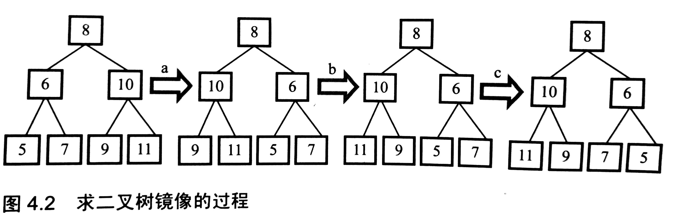

信息——用来消除不确定性的东西，不确定性越大（可能性越多)，包含的信息量越大。
排序算法，最优下界是nlogn，n个数共有n！种排列可能，n！个叶节点，二叉树最小高度nlogn
查找算法
###面试题2，实现Singleton模式
单例模式实现的三种方式
1、getInstance

```java
public class Singleton {
    private static  Singleton uniqueInstance;
    private Singleton(){}//将构造方法设置为private，从而智能调用getInstance方法获取实例
    
    public static synchronized Singleton getInstance(){
        if(uniqueInstance==null)
            uniqueInstance=new Singleton();
        return uniqueInstance;
    }
}
```
缺点：synchronized关键字表明：一次只能有一个线程调用getInstance方法，造成性能低下。
2、加载类时，实例化

```java
public class Singleton {
    private static  Singleton uniqueInstance=new Singleton();
    private Singleton(){}//将构造方法设置为private，从而智能调用getInstance方法获取实例
    public static Singleton getInstance(){
        return uniqueInstance;
    }
}
```
3、双重检查加锁

```java
public class Singleton {
    private volatile static Singleton uniqueInstance;
    private Singleton(){}//将构造方法设置为private，从而智能调用getInstance方法获取实例
    public static Singleton getInstance(){
        if(uniqueInstance==null)
            synchronized (Singleton.class)//只有第一次会执行，以后就不会为空
            {
                if(uniqueInstance==null)
                    uniqueInstance=new Singleton();
            }
        return uniqueInstance;
    }
}
```
***
###面试题3，二维数组中的查找
二维数组<font color =#FF0000 size=4 >每行</font>都是按照从左到右<font color =#FF0000 size=4 >递增</font>的顺序排列，<font color =#FF0000 size=4 >每列</font>都是按照从上到下<font color =#FF0000 size=4 >递增</font>的顺序排列，判断数组中是否有该整数。
例如

|1   | 2     |8     |9  |
|---|---|---|---|
|2   |4      |9     |12|
|4   | 7   |10  |13|
|6    | 8  | 11 | 15|
查找的关键在于逐步缩小查找范围，问题的关键在于选取哪个脚上的数字开始比较。
从右上角开始，9>7，向左，8>7，向左，2<7，向下，4<7，向下，  7=7，找到
***
###面试题3，替换空格
替换字符串，不允许新数组
We are happy    ——> We%20are%20happy
如果从左到右依次替换，由于需要把后面的单词往后移动，因此时间复杂度为n²
可以先统计空格的数量，然后从最后一个单词开始替换。


***
###面试题5，从尾到头打印链表（特殊的链表结构，环形链表、双向链表）
如果要求不能改变链表的结构
遍历的顺序是从头到尾，而要求是从尾到头，因此可以想到后进先出的“栈”结构。
先把输出的节点压栈，到达链表尾部时，将栈中的元素打印。
***
###面试题5，重建二叉树
######知识点回顾，树的四种遍历方式：前序、中序、后序、广度优先
特殊的二叉树：
* 二叉搜索树
  左子节点总是小于等于根节点，右子节点总是大于等于根节点，可以在log(n)查找节点
* 堆
 分为最大堆和最小堆，在最大堆中，根节点的值最大。
* 红黑树
 树中的节点分为红、黑两种颜色，并确保从根节点到叶节点的最长路径长度不超过最短路径的两倍。
######输入某二叉树的前序遍历和中序遍历结果，重建二叉树。
先序序列中，第一个是根节点；中序序列中，根节点位于中间，因此可以根据先序序列的根节点将中序序列分为左、右两个子序列，然后根据中序的左右子序列，确定先序的左右子序列，然后可以递归求解。
***
###面试题7，两个栈实现一个队列
栈，后进先出
队列，先进先出
队列的操作有，队尾插入节点、队头删除节点
插入操作插入到stack1，删除操作，将stack1中的元素全部弹出到stack2，然后在stack2中删除。
######两个队列实现栈
栈的两个操作，栈顶压入元素，栈顶弹出元素
两个队列都是空的，可以将压入栈（a/b/c）的元素插入到queue1中，弹出栈顶的元素(c)时，先将a/b从queue1移动到queue2，然后将c从queue1中删除。
***
###面试题8，旋转数组的最小数字
######知识点回顾
查找：顺序查找、二分查找、哈希表查找、二叉树查找
排序：插入排序、冒泡排序、归并排序、快速排序
重点：二分查找、归并排序、快速排序
<font color =#FF0000 size=4 >实现几个经典的算法，如快排</font>
######例如数组{3，4，5，1，2}是{1，2，3，4，5}的一个旋转数组，该数组的最小值是1
解题分析：如果顺序查找，遍历数组，时间复杂度为O(n)
但是这样并没有利用旋转数组的特性，旋转数组在一定程度上时排好序的，在排序的数组中可以用**二分查找**实现O(logn)的查找


设置两个指针，p1,p2然后和中间值比较
如果*p1<middle,则p1=middle
如果*p2>middle,则p2=middle
***
###面试题9，斐波那契数列（类似问题有跳台阶）
用递归的方式计算斐波那契数列，由于存在大量的重复计算，导致严重的效率问题
可以采用备忘录的方式，将计算过的保存起来
或者从下往上计算
***
###面试题10，二进制中1的个数（位运算）
例如9的二进制是1001，有两位是1，因此输出是2
* 可能引起死循环的解法
基本思路：先判断最右边的一位是不是1，然后把该整数右移一位，再判断是不是1.
                  但是这样很可能出现死循环，比如0x8000，把负数右移一位，并不是0x4000，而是会在左边补1，变成0xc000.再次右移变成，0xe000，0xf000,最后变成0xfffff
* 常规解法
为了避免死循环，不右移输入的数字，首先判断最低位是不是1，然后将1左移变成2，输入的数字和2与运算，判断次低位是不是1。
###面试题12，打印从1到最大的n位数
设计测试用例：功能测试、边界测试、负面测试。
功能测试，突破常规思维的限制，比如打印1到最大的n位数，最大的4位数9999，可能导致超出int甚至long的限制
边界测试，如循环和递归的结束条件
负面测试，错误输入
######n可能会很大，导致超出long的范围，因此需要模拟数字加法

######把问题转换成数字排列的解法，递归使代码更简洁

###面试题13，在O(1)时间删除链表节点
给出*单向链表*的头指针和节点指针，O(1)时间删除该节点。


常规思路：需要顺序遍历找到该节点的前一个节点，然后将前一个节点的next指针指向下一个节点。时间复杂度为O(n)
但是并不需要一定找到前一个节点，可以将下一个节点的内容复制到本节点，然后将下一个节点删除。（本解法的限制在于如果没有下一个节点，还得顺序遍历；此外链表中只有一个节点，需要将头结点置为NULL）
###面试题14，调整数组顺序使奇数位于偶数前面
######常规解法，从头扫描数组，遇到偶数则将该偶数移动到尾部。
由于每个偶数都需要移动O(n)个数字，因此时间复杂度为O(n²)
######升级解法，前面的解法时间复杂度大的原因在于遇到偶数都需要移动到尾部，导致大量的数据移动。
但是要求是奇数位于偶数前面，因此只需要在遇到偶数在奇数前面时，将两个数字交换即可。
设置两个指针p1,p2，其中p1指向第一个数字，p2指向最后一个数字，如果第一个指针指向的数字是偶数，第二个指针指向的数字是奇数，则将两个数交换。（循环结束的条件是p1<p2）
***
###面试题15，输出链表中倒数第K个节点
分析：由于该链表为单向链表，因此走到链表的尾部，然后回溯K步的做法是行不通的
但是由于*倒数*不好数，因此倒数第K个节点可以转换为第n-k+1个节点，节点个数n可以通过遍历链表的方式得到
但是该方法需要遍历链表两次，倒数第K个节点可以通过另个指针来实现，保持两个指针的距离为K-1，当后一个指针到达尾部时，前一个指针即为倒数第K个节点。
PS：代码鲁棒性
1. 输入的链表头指针为null
2. 链表节点个数小于k
3. k=0
######举一反三，当用一个指针遍历链表不能解决问题时，可以尝试用两个指针，两个指针的行为可以不同（如：速度不一样，一个指针可以一次行走两步；或者在链表上先行走）
***
###面试题17，合并两个排序的链表


***
###面试题19，二叉树的镜像
*画图*让抽象问题具体化



求二叉树镜像的过程：先序遍历，如果该节点有子节点，则交换两个子节点。
***
###面试题20，顺时针打印矩阵
按照从外到里顺时针的顺序打印每个数字


打印矩阵可以分为四步：
1. 从左到右打印一行
2. 从上到下打印一列
3. 从右到左打印一行
4. 从下到上打印一列
但是这四步（除第一步外）并不是必须的


***
###面试题22，栈的压入、弹出序列
输入两个整数序列，第一个序列表示栈的压入顺序，判断第二个序列是否是栈的弹出顺序。


算法：如果下一个弹出的数字刚好处于栈顶，那么直接弹出。如果下一个弹出的数字不在栈顶，则将未压入栈的数字压入栈中，直到需要弹出的数字处于栈顶。如果所有数字都压入栈，依然没有找到下一个弹出的数字，那么该序列不是栈的弹出序列。
***
###面试题29，数组中出现次数超过一半的数字
用递归的思路分析问题，但是可以用数组保存中间结果来保存中间结果，然后基于循环实现。
例如，一个长度为9的数组{1，2，3，2，2，2，5，4，2}，由于数字2在数组中出现了5次，超过数组长度的一半，因此输出2.
直观想法，如果数组是排好序的，那么中位数就是该数字（前提条件是存在这样的数）。但是排序的时间复杂度是O(nLogn)
######基于partition函数的O(n)算法
快速排序partition函数的时间复杂度为O(n)
数组中任意第K大的数字，基于partition函数，将index=partition(start，end)函数的返回值和K进行比较:
如果index>K，partition(start,index-1)
index<K，partition(index+1,end)
index=K，ok
######该数字出现的次数比其他数字出现次数的和还要多
下一个数字相同，次数+1
下一个数字不同，次数-1，次数=0，保存该数字，并设置次数为1. 


###面试题30，最小的K个数
例如，输入4，5，1，6，2，7，3，8，则最小的四个数是1，2，3，4
1. 常规思路，先排序，O(nlogn)

2. 基于Partition函数解决问题：（k个数字不是排好序的）
如果index>K，partition(start,index-1)
index<K，partition(index+1,end)
index=K，ok
时间复杂度为O(n)
时间复杂度分析   T(n)<=T(n/a)+O(n)  因为每次partition后，问题的规模变为原来的一部分，1/a为最大值
因此T(n)=O(n)       ————该部分证明见数据结构与算法P294


 
3. 海量数据处理，O(nlogk)
创建一个大小为K的容器，然后每次输入一个数
如果容器未满，则加入容器
如果容器已满，则判断容器中的最大值是否小于当前值，如果小于则替换最大值；如果不小于，那么该数不可能是
对于该容器的要求：
找到K个整数中的最大值
删除最大值
插入新的数，还能方便地找到最大值
于是我们想到了最大堆，最大堆可以在O(1)时间找到最大值，但是删除和插入需要O(logk)
PriortyQueue
红黑树 TreeSet TreeMap 

```java
//解决输入有重复的情况，因为Set在加入元素时，会通过compareTo检查元素是否有重复
//PS:TreeSet是由于需要指导元素的大小关系，因此才会调用compare；HashSet只需要知道是否相等，因此只会调用equals。
public class TreeSetTest implements Comparable<TreeSetTest>{
    private int data;
    private int num;
    public TreeSetTest(int data)
    {
        this.data=data;
        this.num=1;
    }
    @Override
    public int compareTo(TreeSetTest o) {
        if(this.data>o.data)return 1;
        else if(this.data<o.data)return -1;
        else {//如果两个数相等，则将数量+1
            o.num++;
            return 0;//返回0，表示不加入set中
        }
 
    }
}
```
平衡二叉树，是二叉查找树的进化体，它的左右子树高度之差不能超过1，区别在于插入和删除之后要进行*旋转*维持平衡。
将二叉树维持在一个平衡状态，很好地解决了二叉查找树退化为链表的问题，把插入、查找、删除的时间复杂度维持在O(logN)，但是频繁地旋转会使插入和删除牺牲O(longN)的时间。
####面试题31、连续子数组的最大和
例如输入{1，-2,3,10，-4,7,2，-5}
*动态规划*
函数f(i)表示以第i个数字结尾的子数组的最大和，问题转化为求max[f(i)]
递推公式
如果i=0或者f(i-1)<=0，f(i)=data[i]
如果i!=0并且f(i-1)>0，f(i)=f(i-1)+data[i]

####面试题32、从1到n的整数中1出现的次数
如果通过计算1~n，N个数字中每个数字1的个数（需要检查每一位是否为1），然后累加，则时间复杂度为nlogn
实际上该问题存在递归特性，可以去掉高位做递归
例如输入21345
可以先计算 [1346,21345 ]，再递归计算[1,1345]，其中后者可以看做去掉最到位2的结果
 [1346,21345 ]
1出现在万位的情况，[10000,19999]，共10000次，但是对于万位为1的情况，例如 [2346, 12345]，则1出现了12345-10000+1=2346
1出现在千为的情况，[1346，1999]  [11000，11999]     [21000，21345]

####面试题33、数组排成最小的数
需要确定一种规则，判断m和n哪个应该排在前面，而不是仅仅比较两个数字的大小
两个数字m、n可以组成mn和nm
如果mn<nm，m应该排在n的前面。
那么如何将m、n拼接成一个数字呢？
拼接的时候需要考虑溢出的问题，因此这还是一个隐形的大叔问题。
解决方式是：把数字转换成字符串，因为mn、nm 数字的位数相等，因此字符串的大小就是数字的大小。

```java
public class MinNumber implements Comparable<MinNumber>{
    private int data;
    public MinNumber(int data)
    {
        this.data=data;
    }
    public static void main(String []args)
    {
        List<MinNumber> list=new ArrayList<MinNumber>();
        list.add(new MinNumber(3));
        list.add(new MinNumber(32));
        list.add(new MinNumber(321));
        Collections.sort(list);  //快速排序 时间复杂度O(nlogn)
        for(MinNumber ele:list)
            System.out.print(ele.data);
    }
 
    @Override
    public int compareTo(MinNumber o) {//定义新的比较规则，比较两个数拼接的大小
        String result1=this.data+""+o.data;
        String result2=o.data+""+this.data;
        return result1.compareTo(result2);
    }
}
```
*时间效率和空间效率的平衡*
####面试题34、丑数，只包含因子2,3,5的数称为丑数，求第1500个丑数
虽然可以从1开始，判断整数是不是丑数，直到求出第1500个丑数，但是时间复杂度较高
根据丑数的定义，丑数是一个丑数乘以2/3/5得到的
因此，我们可以采用类似于动态规划的思想，用一个数组保存已知的丑数，然后通过已知的丑数，计算下一个丑数。
下一个丑数是大于当前最大丑数，M1*2，M2*3，M3*5，三个丑数中的一个
因此我们需要保存，第一个满足M1*2>max

```java
private static int UglyNumber(int index)
    {
        int []uglyNumber=new int[index];
        int totalNum=1;
        uglyNumber[0]=1;
        int uglyN2=0,uglyN3=0,uglyN5=0;
        while(totalNum<index)
        {
            int min=min(uglyNumber[uglyN2]*2,uglyNumber[uglyN3]*3,uglyNumber[uglyN5]*5);
            System.out.print(min+"   ");
            uglyNumber[totalNum]=min;
            while(uglyNumber[uglyN2]*2<=uglyNumber[totalNum])uglyN2++;   //计算M1
            while(uglyNumber[uglyN3]*3<=uglyNumber[totalNum])uglyN3++;   //计算
            while(uglyNumber[uglyN5]*5<=uglyNumber[totalNum])uglyN5++;
            totalNum++;
        }
        return uglyNumber[index-1];
    }
```
####面试题36、数组中的逆序对
{7,5,6,4} 逆序对{7,6}、{7,5}、{7,4}、{6,4}、{5,4}
采用分治的思路，可以将数组分为{7，5,6} {4},递归求{7,5,6}，但是复杂度由T(n)变成T（n-1），付出的代价是4需要和前面的集合比较，O(n-1)
因此整体的时间复杂度为O(n²)
要想变成log，就需要将数组分解成两半，先统计前半部分的逆序对，再统计后半部分的逆序对，然后在统计合并时的逆序对
由此联想到归并排序


 其中两部分都是排好序的
（a）7>6
逆序对的数量为4+6（当前指针所指的元素及其之前的元素）
（b）5<6
逆序对数量为0
（c）5<4
逆序对数量为4
时间复杂度为O(nlogn)

####面试题38、数字在排序数组中出现的次数
例如，{1,2,3,3,3,3,4,5}，那么数字3出现的次数是4
常规的思路是：可以从头到尾扫描一遍，遇到数字3，num++，该算法的时间复杂度是O（n）
该算法未充分利用数组排序的特点
对于排序的数组（算法的复杂度要想成为logn），联想到二分查找
问题可以转化为其第一个3出现的位置和最后一个3出现的位置，然后分别用二分查找解决
第一个3的查找方法：
二分查找3，如果找到3，则判断前一个位置是否是3，如果是3，则第一个3的位置还在前面；如果不是3，则第一个3的位置找到。

####面试题39、求二叉树的深度
可以递归求

```java
private int treeDepth(BinaryTree root)
    {
        if(root==null)return 0;
        int nLeft=treeDepth(root.left);
        int nRight=treeDepth(root.right);
        return (nLeft>nRight)?(nLeft+1):(nRight+1);
    }
```

####面试题39-1、判断二叉树是不是平衡二叉树
任意节点的左右子树深度相差不超过1
可能会想到递归求每个节点的左右子树深度，从而判断是否是平衡二叉树。但是这样会导致重复求某个节点的深度（类似于递归求斐波那契数列）
可以后序遍历二叉树，一边遍历，一边判断某个节点是不是平衡。或者将已知的节点深度保存在数组。

```java
public class TreeBlance {
    public boolean isBalanced(TreeNode root) {
 
        if(checkHeight(root)==-1)return false;
        return true;
    }
    private int checkHeight(TreeNode root)
    {//返回-1，表示不平衡
        if(root==null)return 0;
        int lHeight=checkHeight(root.left);
        int rHeight=checkHeight(root.right);
        if(lHeight==-1||rHeight==-1||Math.abs(lHeight-rHeight)>1)return -1;
        else return lHeight>rHeight?lHeight+1:rHeight+1;
    }
}
```

####递增数组和为某值的两个数
例如，{1,2,4,7,11,15} 和为15的数字是4和11
和为15的两个数一定满足以下关系  data1<7.5&&data2>7.5
因此可以定义连个index，data[index]=1  data[index2]=15
data[index]  + data[index2] = 16 >15    因此index2--；
data[index]  +  data[index2] =  12  <15   因此index1 ++;
data[index]  +  data[index2] =  13  <15   因此index1 ++;
data[index]  +  data[index2] =  15  = 15 


面试过程中，考虑所有可能的测试用例，null、溢出。。。，否则会给面试官思维不严谨，编程习惯不好的印象。

####数组中只出现一次的数字
先考虑只有一个数字出现一次，其他数字都出现了两次，因此可以逐个异或，由于异或满足交换律，因此出现两次的数字异或的结果为0，最后只剩只出现一次的数字。
但是如果好多个数字出现了两次，我们可以根据异或的结果将数字分为两组，按照异或结果不为0的一位，将数字分为两组
比如{2，4，3，6，3，2，5，5}，异或的结果为0010，因此根据第二位，将数字分为{2，3，6，3，2}和{4，5，5}，接下来问题转化为只有一个数字出现一次的情况。
与(&)、非(~)、或(|)、异或(\^)


